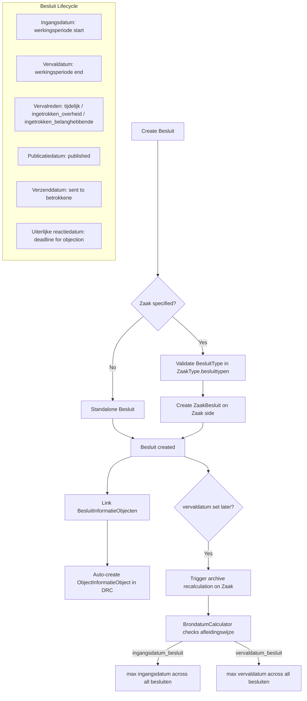

# Besluit (Decision) Flow

```mermaid
graph TD
    A[Create Besluit] --> B{Zaak specified?}
    B -->|Yes| C[Validate BesluitType in ZaakType.besluittypen]
    B -->|No| D[Standalone Besluit]

    C --> E[Create ZaakBesluit on Zaak side]
    D --> F[Besluit created]
    E --> F

    F --> G[Link BesluitInformatieObjecten]
    G --> H[Auto-create ObjectInformatieObject in DRC]

    F --> I{vervaldatum set later?}
    I -->|Yes| J[Trigger archive recalculation on Zaak]
    J --> K[BrondatumCalculator checks afleidingswijze]
    K -->|ingangsdatum_besluit| L[max ingangsdatum across all besluiten]
    K -->|vervaldatum_besluit| M[max vervaldatum across all besluiten]

    subgraph "Besluit Lifecycle"
        N[Ingangsdatum: werkingsperiode start]
        O[Vervaldatum: werkingsperiode end]
        P[Vervalreden: tijdelijk / ingetrokken_overheid / ingetrokken_belanghebbende]
        Q[Publicatiedatum: published]
        R[Verzenddatum: sent to betrokkene]
        S[Uiterlijke reactiedatum: deadline for objection]
    end
```
