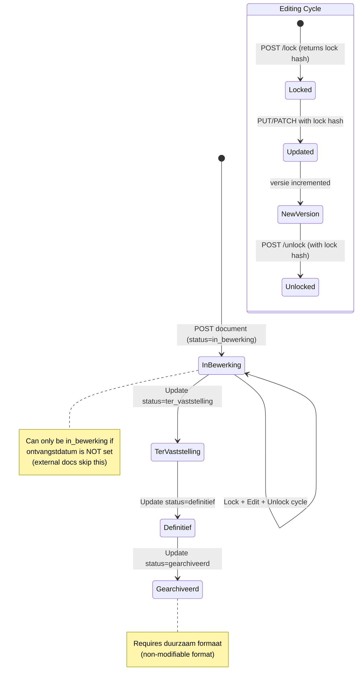
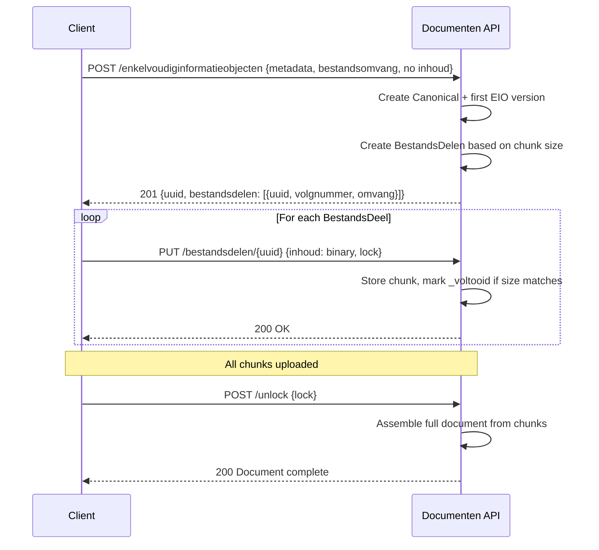
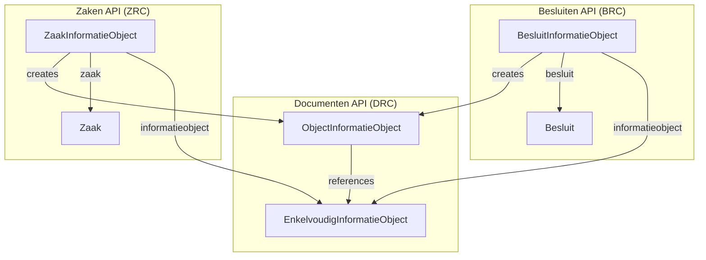

# Document Lifecycle Flow

```mermaid
stateDiagram-v2
    [*] --> InBewerking: POST document (status=in_bewerking)
    InBewerking --> InBewerking: Lock + Edit + Unlock cycle

    state "Editing Cycle" as Edit {
        [*] --> Locked: POST /lock (returns lock hash)
        Locked --> Updated: PUT/PATCH with lock hash
        Updated --> NewVersion: versie incremented
        NewVersion --> Unlocked: POST /unlock (with lock hash)
    }

    InBewerking --> TerVaststelling: Update status=ter_vaststelling
    TerVaststelling --> Definitief: Update status=definitief
    Definitief --> Gearchiveerd: Update status=gearchiveerd

    note right of InBewerking
        Can only be in_bewerking if
        ontvangstdatum is NOT set
        (external docs skip this)
    end note

    note right of Gearchiveerd
        Requires duurzaam formaat
        (non-modifiable format)
    end note
```

## Chunked Upload Flow

```mermaid
sequenceDiagram
    participant Client
    participant DRC as Documenten API

    Client->>DRC: POST /enkelvoudiginformatieobjecten {metadata, bestandsomvang, no inhoud}
    DRC->>DRC: Create Canonical + first EIO version
    DRC->>DRC: Create BestandsDelen based on chunk size
    DRC-->>Client: 201 {uuid, bestandsdelen: [{uuid, volgnummer, omvang}]}

    loop For each BestandsDeel
        Client->>DRC: PUT /bestandsdelen/{uuid} {inhoud: binary, lock}
        DRC->>DRC: Store chunk, mark _voltooid if size matches
        DRC-->>Client: 200 OK
    end

    Note over Client,DRC: All chunks uploaded
    Client->>DRC: POST /unlock {lock}
    DRC->>DRC: Assemble full document from chunks
    DRC-->>Client: 200 Document complete
```

## Cross-Reference Flow

```mermaid
graph TD
    subgraph "Documenten API (DRC)"
        EIO[EnkelvoudigInformatieObject]
        OIO[ObjectInformatieObject]
    end

    subgraph "Zaken API (ZRC)"
        Zaak
        ZIO[ZaakInformatieObject]
    end

    subgraph "Besluiten API (BRC)"
        Besluit
        BIO[BesluitInformatieObject]
    end

    ZIO -->|creates| OIO
    BIO -->|creates| OIO
    OIO -->|references| EIO
    ZIO -->|zaak| Zaak
    ZIO -->|informatieobject| EIO
    BIO -->|besluit| Besluit
    BIO -->|informatieobject| EIO
```
