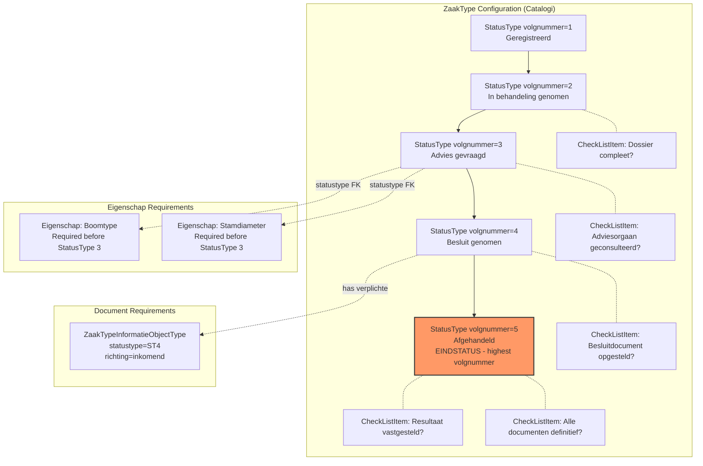
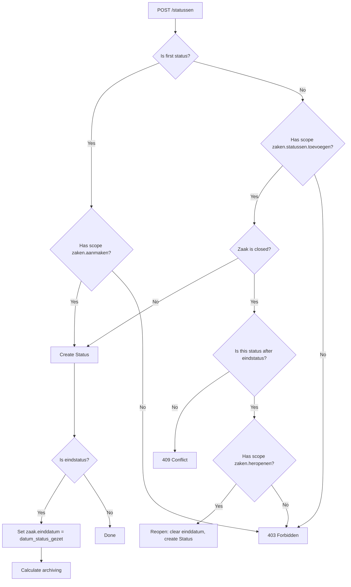

# StatusType Progression

```mermaid
graph TD
    subgraph "ZaakType Configuration (Catalogi)"
        ST1[StatusType volgnummer=1<br/>Geregistreerd]
        ST2[StatusType volgnummer=2<br/>In behandeling genomen]
        ST3[StatusType volgnummer=3<br/>Advies gevraagd]
        ST4[StatusType volgnummer=4<br/>Besluit genomen]
        ST5[StatusType volgnummer=5<br/>Afgehandeld<br/>EINDSTATUS - highest volgnummer]

        ST1 --> ST2 --> ST3 --> ST4 --> ST5

        CL2[CheckListItem: Dossier compleet?]
        CL3[CheckListItem: Adviesorgaan geconsulteerd?]
        CL4[CheckListItem: Besluitdocument opgesteld?]
        CL5a[CheckListItem: Resultaat vastgesteld?]
        CL5b[CheckListItem: Alle documenten definitief?]

        ST2 -.- CL2
        ST3 -.- CL3
        ST4 -.- CL4
        ST5 -.- CL5a
        ST5 -.- CL5b
    end

    subgraph "Eigenschap Requirements"
        E1[Eigenschap: Boomtype<br/>Required before StatusType 3]
        E2[Eigenschap: Stamdiameter<br/>Required before StatusType 3]
        ST3 -.->|statustype FK| E1
        ST3 -.->|statustype FK| E2
    end

    subgraph "Document Requirements"
        ZIOT[ZaakTypeInformatieObjectType<br/>statustype=ST4<br/>richting=inkomend]
        ST4 -.->|has verplichte| ZIOT
    end

    style ST5 fill:#f96,stroke:#333,stroke-width:2px
```

## Status Setting Rules

```mermaid
graph TD
    A[POST /statussen] --> B{Is first status?}
    B -->|Yes| C{Has scope zaken.aanmaken?}
    B -->|No| D{Has scope zaken.statussen.toevoegen?}

    C -->|Yes| E[Create Status]
    C -->|No| F[403 Forbidden]
    D -->|Yes| G{Zaak is closed?}
    D -->|No| F

    G -->|No| E
    G -->|Yes| H{Is this status after eindstatus?}
    H -->|No| I[409 Conflict]
    H -->|Yes| J{Has scope zaken.heropenen?}
    J -->|Yes| K[Reopen: clear einddatum, create Status]
    J -->|No| F

    E --> L{Is eindstatus?}
    L -->|Yes| M[Set zaak.einddatum = datum_status_gezet]
    M --> N[Calculate archiving]
    L -->|No| O[Done]
```
