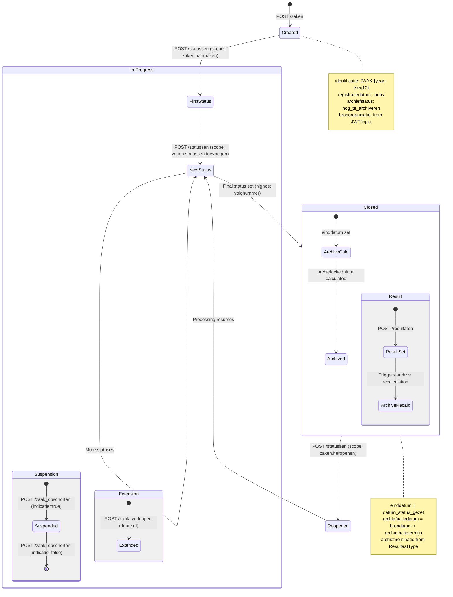
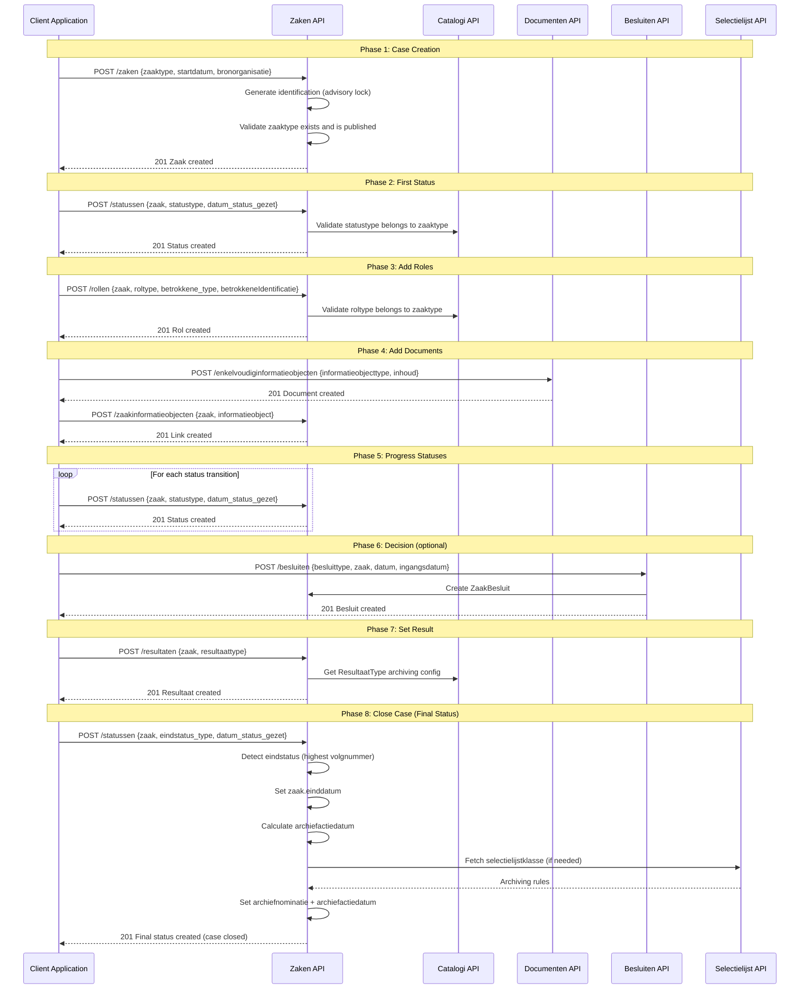

# Zaak Lifecycle Flow

```mermaid
stateDiagram-v2
    [*] --> Created: POST /zaken
    Created --> FirstStatus: POST /statussen (scope: zaken.aanmaken)

    state "In Progress" as InProgress {
        FirstStatus --> NextStatus: POST /statussen (scope: zaken.statussen.toevoegen)
        NextStatus --> NextStatus: More statuses

        state "Suspension" as Susp {
            [*] --> Suspended: POST /zaak_opschorten (indicatie=true)
            Suspended --> [*]: POST /zaak_opschorten (indicatie=false)
        }

        state "Extension" as Ext {
            [*] --> Extended: POST /zaak_verlengen (duur set)
        }
    }

    NextStatus --> Closed: Final status set (highest volgnummer)

    state "Closed" as Closed {
        [*] --> ArchiveCalc: einddatum set
        ArchiveCalc --> Archived: archiefactiedatum calculated

        state "Result" as Res {
            [*] --> ResultSet: POST /resultaten
            ResultSet --> ArchiveRecalc: Triggers archive recalculation
        }
    }

    Closed --> Reopened: POST /statussen (scope: zaken.heropenen)
    Reopened --> NextStatus: Processing resumes

    note right of Created
        identificatie: ZAAK-{year}-{seq10}
        registratiedatum: today
        archiefstatus: nog_te_archiveren
        bronorganisatie: from JWT/input
    end note

    note right of Closed
        einddatum = datum_status_gezet
        archiefactiedatum = brondatum + archiefactietermijn
        archiefnominatie from ResultaatType
    end note
```

## Sequence: Creating and Processing a Zaak

```mermaid
sequenceDiagram
    participant App as Client Application
    participant ZRC as Zaken API
    participant ZTC as Catalogi API
    participant DRC as Documenten API
    participant BRC as Besluiten API
    participant SL as Selectielijst API

    Note over App,SL: Phase 1: Case Creation
    App->>ZRC: POST /zaken {zaaktype, startdatum, bronorganisatie}
    ZRC->>ZRC: Generate identification (advisory lock)
    ZRC->>ZRC: Validate zaaktype exists and is published
    ZRC-->>App: 201 Zaak created

    Note over App,SL: Phase 2: First Status
    App->>ZRC: POST /statussen {zaak, statustype, datum_status_gezet}
    ZRC->>ZTC: Validate statustype belongs to zaaktype
    ZRC-->>App: 201 Status created

    Note over App,SL: Phase 3: Add Roles
    App->>ZRC: POST /rollen {zaak, roltype, betrokkene_type, betrokkeneIdentificatie}
    ZRC->>ZTC: Validate roltype belongs to zaaktype
    ZRC-->>App: 201 Rol created

    Note over App,SL: Phase 4: Add Documents
    App->>DRC: POST /enkelvoudiginformatieobjecten {informatieobjecttype, inhoud}
    DRC-->>App: 201 Document created
    App->>ZRC: POST /zaakinformatieobjecten {zaak, informatieobject}
    ZRC-->>App: 201 Link created

    Note over App,SL: Phase 5: Progress Statuses
    loop For each status transition
        App->>ZRC: POST /statussen {zaak, statustype, datum_status_gezet}
        ZRC-->>App: 201 Status created
    end

    Note over App,SL: Phase 6: Decision (optional)
    App->>BRC: POST /besluiten {besluittype, zaak, datum, ingangsdatum}
    BRC->>ZRC: Create ZaakBesluit
    BRC-->>App: 201 Besluit created

    Note over App,SL: Phase 7: Set Result
    App->>ZRC: POST /resultaten {zaak, resultaattype}
    ZRC->>ZTC: Get ResultaatType archiving config
    ZRC-->>App: 201 Resultaat created

    Note over App,SL: Phase 8: Close Case (Final Status)
    App->>ZRC: POST /statussen {zaak, eindstatus_type, datum_status_gezet}
    ZRC->>ZRC: Detect eindstatus (highest volgnummer)
    ZRC->>ZRC: Set zaak.einddatum
    ZRC->>ZRC: Calculate archiefactiedatum
    ZRC->>SL: Fetch selectielijstklasse (if needed)
    SL-->>ZRC: Archiving rules
    ZRC->>ZRC: Set archiefnominatie + archiefactiedatum
    ZRC-->>App: 201 Final status created (case closed)
```
