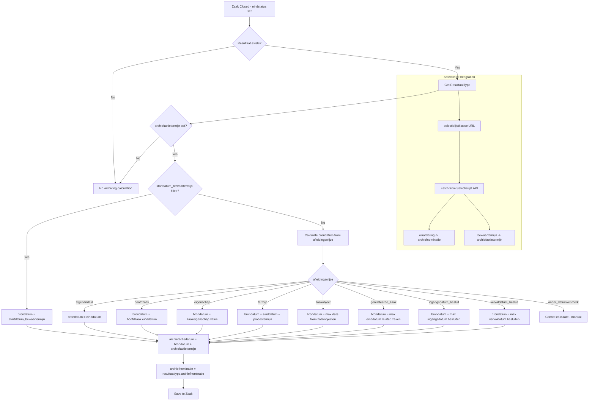
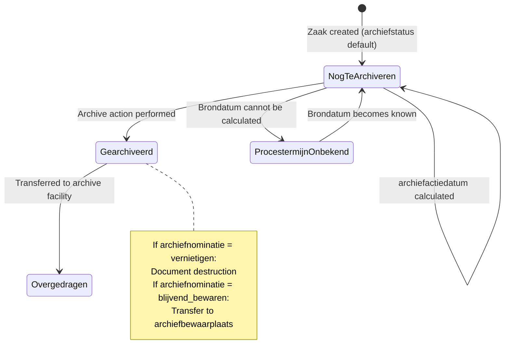

# Archivering (Archiving)

## Purpose

Archiving is a legal requirement for Dutch government organizations. Every case must be either permanently preserved ("blijvend bewaren") or destroyed after a retention period ("vernietigen"). The archiving rules are determined by the ResultaatType's connection to the national Selectielijst and the brondatum_archiefprocedure configuration.

### Relevance to Procest

Dutch government archiving compliance is non-negotiable. The entire selectielijst integration, brondatum calculation, and archiefactiedatum computation is one of the most complex parts of OpenZaak and a major differentiator.

## Architecture

The archiving system spans two components:
1. **Catalogi (ZTC)**: ResultaatType defines the archiving rules (archiefnominatie, archiefactietermijn, brondatum_archiefprocedure)
2. **Zaken (ZRC)**: Zaak stores the computed values (archiefnominatie, archiefstatus, archiefactiedatum) and contains the `BrondatumCalculator` logic

The calculation is triggered when:
- A Zaak is closed (eindstatus set)
- A Resultaat is set/changed on a closed Zaak
- A Besluit's vervaldatum changes

## Data Model - Archiving Fields on Zaak

| Field | Type | Description |
|-------|------|-------------|
| archiefnominatie | choices | blijvend_bewaren / vernietigen |
| archiefstatus | choices | nog_te_archiveren / gearchiveerd / gearchiveerd_procestermijn_onbekend / overgedragen |
| archiefactiedatum | DateField | Date when archive action must occur |
| startdatum_bewaartermijn | DateField | Start of retention period |
| processobjectaard | CharField(200) | Process object description |
| processobject | GegevensGroep | datumkenmerk, identificatie, objecttype, registratie |

## Data Model - Archiving Config on ResultaatType

| Field | Type | Description |
|-------|------|-------------|
| selectielijstklasse | URLField | Reference to national Selectielijst API |
| archiefnominatie | choices | Derived from selectielijstklasse (waardering) |
| archiefactietermijn | DurationField | Derived from selectielijstklasse (bewaartermijn) |
| brondatum_archiefprocedure | GegevensGroep | How to determine the brondatum |

### Afleidingswijze (Derivation Methods)

| Method | Brondatum Source | Description |
|--------|------------------|-------------|
| afgehandeld | zaak.einddatum | Date case was completed |
| hoofdzaak | hoofdzaak.einddatum | Completion date of parent case |
| eigenschap | zaakeigenschap.waarde | Value of a specific case property |
| ander_datumkenmerk | manual | Must be determined manually |
| zaakobject | zaakobject attribute | Attribute of a related object |
| termijn | einddatum + procestermijn | End date plus process term |
| gerelateerde_zaak | max(relevante_zaken.einddatum) | Latest end date of related cases |
| ingangsdatum_besluit | max(besluiten.ingangsdatum) | Latest decision effective date |
| vervaldatum_besluit | max(besluiten.vervaldatum) | Latest decision expiry date |

## Business Logic

### Archive Lifecycle

## Key Business Rules

1. **Automatic calculation**: archiefactiedatum is automatically calculated when a Resultaat is set on a closed Zaak
2. **Force recalculation**: `try_calculate_archiving(zaak, force=True)` recalculates even if values exist
3. **Advisory lock for ID generation**: Prevents race conditions in identification generation
4. **Nested datumkenmerk**: For zaakobject afleidingswijze, nested attributes can be specified with `/` separator
5. **Multiple dates**: For zaakobject and gerelateerde_zaak, the maximum date across all objects is used
6. **blijvend_bewaren default**: If archiefnominatie is blijvend_bewaren and no afleidingswijze is set, it defaults to "afgehandeld"

## Procest Comparison

| Feature | Already in Procest | Not yet in Procest |
|---------|-------------------|-------------------|
| Archive nomination | No | blijvend_bewaren / vernietigen |
| Archive status tracking | No | 4-state archiefstatus |
| Archive action date | No | Automatic archiefactiedatum calculation |
| Selectielijst integration | No | URL reference to national Selectielijst API |
| 9 brondatum derivation methods | No | Full BrondatumCalculator |
| Retention period calculation | No | brondatum + archiefactietermijn |
| Process term support | No | procestermijn DurationField |
| Cross-entity date lookup | No | Dates from zaakobjecten, besluiten, related zaken |
| Manual determination fallback | No | ander_datumkenmerk with manual process |
| Recalculation on besluit change | No | Triggered by vervaldatum update |
