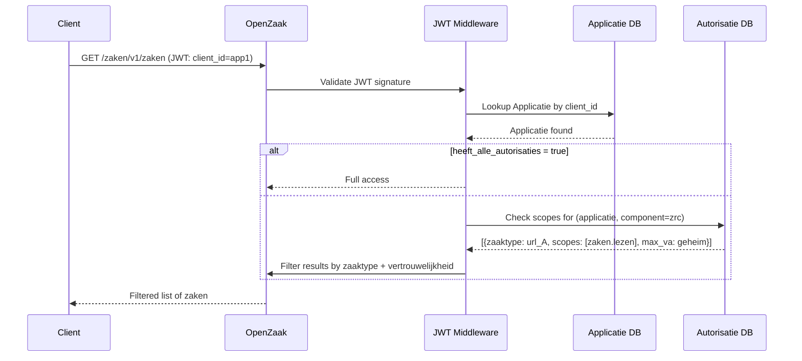
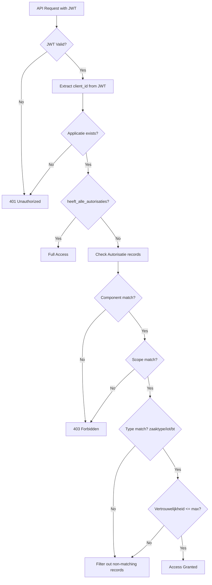

# Autorisaties Model

## Purpose

The Autorisaties component controls which applications can access which data. It implements a JWT-based authentication model where each client application (Applicatie) is granted specific scopes per component, per zaaktype/informatieobjecttype/besluittype, with a maximum confidentiality level.

### Relevance to Procest

This is fundamentally different from Nextcloud's user-based auth. OpenZaak authenticates machine-to-machine (M2M) API calls using JWTs signed with shared secrets. Understanding this is critical because Procest runs inside Nextcloud (user-based) while OpenZaak is designed for a service-oriented architecture.

## Architecture

The authorization stack:
1. **JWT Authentication**: Each API request carries a JWT token with `client_id` claim
2. **Applicatie**: Registered client with `client_ids` (list of allowed client IDs) and a `secret` for JWT verification
3. **Autorisatie** (from vng-api-common): Per-component scopes for an Applicatie, scoped to specific type URLs
4. **CatalogusAutorisatie** (OpenZaak extension): Grants scopes for ALL types within a Catalogus

The middleware validates JWTs, looks up the Applicatie, and checks if the requested scope + zaaktype/informatieobjecttype + vertrouwelijkheid level is authorized.

## Data Model - Applicatie (from vng-api-common)

| Field | Type | Required | Description |
|-------|------|----------|-------------|
| uuid | UUID4 | auto | Unique identifier |
| client_ids | ArrayField(CharField) | yes | JWT client_id values |
| label | CharField | yes | Human-readable name |
| heeft_alle_autorisaties | BooleanField | default=false | Superuser mode (all access) |

## Data Model - Autorisatie (from vng-api-common)

| Field | Type | Required | Description |
|-------|------|----------|-------------|
| applicatie | FK(Applicatie) | yes | Client application |
| component | choices | yes | zrc/drc/brc/ztc/ac |
| scopes | ArrayField(CharField) | yes | Granted scope labels |
| zaaktype | URLField | conditional | Specific ZaakType URL (for ZRC) |
| informatieobjecttype | URLField | conditional | Specific IOT URL (for DRC) |
| besluittype | URLField | conditional | Specific BesluitType URL (for BRC) |
| max_vertrouwelijkheidaanduiding | choices | yes | Maximum confidentiality level |

## Data Model - CatalogusAutorisatie (OpenZaak extension)

| Field | Type | Required | Description |
|-------|------|----------|-------------|
| applicatie | FK(Applicatie) | yes | Client application |
| catalogus | FK(Catalogus) | yes | Catalogue reference |
| component | choices(zrc/drc/brc) | yes | Component |
| scopes | ArrayField(CharField) | yes | Granted scope labels |
| max_vertrouwelijkheidaanduiding | choices | yes | Maximum confidentiality level |

Unique constraint: (applicatie, catalogus, component)

When a new ZaakType/InformatieObjectType/BesluitType is created in a Catalogus, `CatalogusAutorisatie.sync` is called to notify affected Applicaties that their authorizations have changed.

## Scopes per Component

### Zaken API (ZRC)
| Scope | Description |
|-------|-------------|
| zaken.aanmaken | Create cases, set first status, create objects/roles |
| zaken.lezen | List/search/retrieve cases and related objects |
| zaken.bijwerken | Update case attributes |
| zaken.verwijderen | Delete cases |
| zaken.statussen.toevoegen | Add statuses to cases |
| zaken.geforceerd-bijwerken | Modify closed cases |
| zaken.heropenen | Reopen cases (create status after final) |

### Documenten API (DRC)
| Scope | Description |
|-------|-------------|
| documenten.aanmaken | Create documents |
| documenten.lezen | Read documents |
| documenten.bijwerken | Update documents |
| documenten.verwijderen | Delete documents |
| documenten.lock | Lock/unlock documents |
| documenten.geforceerd-unlock | Force unlock without lock key |

### Besluiten API (BRC)
| Scope | Description |
|-------|-------------|
| besluiten.aanmaken | Create decisions |
| besluiten.lezen | Read decisions |
| besluiten.bijwerken | Update decisions |
| besluiten.verwijderen | Delete decisions |

### Catalogi API (ZTC)
| Scope | Description |
|-------|-------------|
| catalogi.lezen | Read all catalogue resources |
| catalogi.schrijven | Write all catalogue resources |
| catalogi.geforceerd-schrijven | Modify published (non-concept) types |
| catalogi.geforceerd-verwijderen | Delete published types |

### Autorisaties API (AC)
| Scope | Description |
|-------|-------------|
| autorisaties.lezen | Read authorizations |
| autorisaties.bijwerken | Create/update/delete authorizations |

## API Endpoints

| Method | Path | Scope | Description |
|--------|------|-------|-------------|
| GET | /autorisaties/v1/applicaties | autorisaties.lezen | List applications |
| POST | /autorisaties/v1/applicaties | autorisaties.bijwerken | Create application |
| GET | /autorisaties/v1/applicaties/{uuid} | autorisaties.lezen | Retrieve application |
| PUT/PATCH | /autorisaties/v1/applicaties/{uuid} | autorisaties.bijwerken | Update application |
| DELETE | /autorisaties/v1/applicaties/{uuid} | autorisaties.bijwerken | Delete application |

## Business Logic

### Authorization Flow Detail

## Key Business Rules

1. **JWT structure**: Must contain `client_id` claim, signed with the Applicatie's secret
2. **Multi-client support**: One Applicatie can have multiple `client_ids`
3. **Type-scoped authorization**: Scopes are granted per zaaktype/informatieobjecttype/besluittype URL
4. **Vertrouwelijkheid filtering**: Records with higher confidentiality than max_vertrouwelijkheidaanduiding are filtered out
5. **CatalogusAutorisatie**: Grants access to ALL current and future types within a catalogue
6. **Notification on change**: When types are created/modified, affected Applicaties are notified via notification channels

## Procest Comparison

| Feature | Already in Procest | Not yet in Procest |
|---------|-------------------|-------------------|
| Authentication | Nextcloud user sessions | JWT M2M authentication |
| Client registration | No | Applicatie + client_ids + secret |
| Scope-based authorization | No | Fine-grained scopes per component |
| Type-level authorization | No | Per zaaktype/iot/bt scoping |
| Confidentiality filtering | No | max_vertrouwelijkheidaanduiding |
| Catalogue-wide authorization | No | CatalogusAutorisatie |
| Superuser mode | Nextcloud admin | heeft_alle_autorisaties |
| Auto-sync on type creation | No | CatalogusAutorisatie.sync |
| Notification on auth change | No | Webhook notifications |
