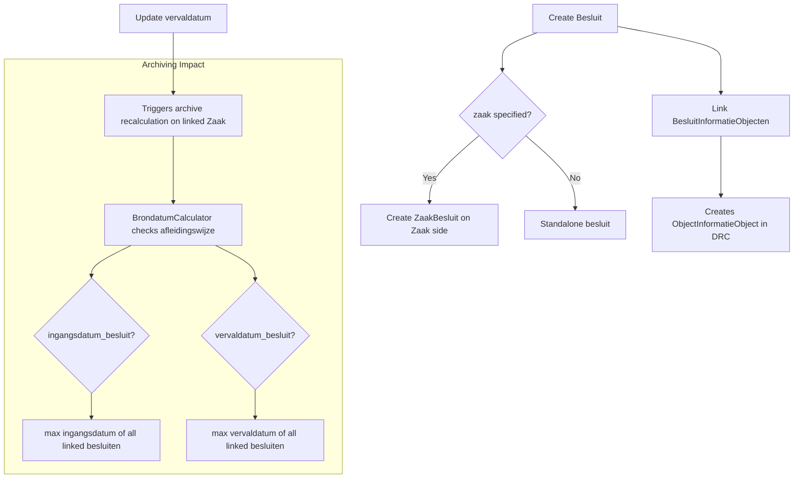

# Besluiten API (BRC)

## Purpose

The Besluiten API manages decisions (besluiten) taken in the context of case handling. A Besluit is a formal decision by a governing body (bestuursorgaan), linked to a BesluitType, optionally to a Zaak, and to InformatieObjecten that document the decision.

### Relevance to Procest

Formal decision-making is a core part of government case handling. Many case types result in a formal decision (permit granted/denied, subsidy approved, etc.). Procest needs to support this workflow.

## Data Model - Besluit

| Field | Type | Required | Description |
|-------|------|----------|-------------|
| uuid | UUID4 | auto | Unique identifier |
| identificatie | CharField(50) | auto-gen | Decision identifier |
| verantwoordelijke_organisatie | RSIN(9) | yes | Responsible organisation |
| besluittype | FkOrServiceUrl | yes | Reference to BesluitType |
| zaak | FkOrServiceUrl | no | Related case (optional) |
| datum | DateField | yes | Decision date (must be today or earlier) |
| toelichting | TextField | no | Explanation |
| bestuursorgaan | CharField(50) | no | Governing body (Burgemeester, Gemeenteraad, College van B&W) |
| ingangsdatum | DateField | yes | Effective start date |
| vervaldatum | DateField | no | Expiry date |
| vervalreden | choices | no | Reason for expiry (tijdelijk/ingetrokken_overheid/ingetrokken_belanghebbende) |
| publicatiedatum | DateField | no | Publication date |
| verzenddatum | DateField | no | Send date |
| uiterlijke_reactiedatum | DateField | no | Deadline for objection |

Key constraint: Unique together (identificatie, verantwoordelijke_organisatie)

## Data Model - BesluitInformatieObject

| Field | Type | Required | Description |
|-------|------|----------|-------------|
| uuid | UUID4 | auto | Unique identifier |
| besluit | FK(Besluit) | yes | Decision reference |
| informatieobject | FkOrServiceUrl | yes | Document reference |

## API Endpoints

| Method | Path | Scope | Description |
|--------|------|-------|-------------|
| GET/POST | /besluiten/v1/besluiten | besluiten.lezen/aanmaken | CRUD decisions |
| GET/PUT/PATCH | /besluiten/v1/besluiten/{uuid} | besluiten.lezen/bijwerken | Detail + update |
| DELETE | /besluiten/v1/besluiten/{uuid} | besluiten.verwijderen | Delete decision |
| GET | /besluiten/v1/besluiten/{uuid}/audittrail | besluiten.lezen | Audit trail |
| GET/POST | /besluiten/v1/besluitinformatieobjecten | besluiten.lezen/aanmaken | Link docs to decisions |
| POST | /besluiten/v1/besluit_verwerken | besluiten.aanmaken | Process decision (batch) |

## Business Logic

## Key Business Rules

1. **Identification**: Auto-generated if not provided, using `generate_unique_identification` based on datum
2. **Zaak linkage**: Optional -- a besluit can exist without a zaak (e.g., standalone policy decisions)
3. **Previous zaak tracking**: On update, the previous zaak is tracked for trigger handling
4. **Vervaldatum triggers archiving**: Changing vervaldatum triggers `try_calculate_archiving` on the linked zaak
5. **Cross-API sync**: Creating a BesluitInformatieObject creates an ObjectInformatieObject in the DRC, and linking a Besluit to a Zaak creates a ZaakBesluit

## Procest Comparison

| Feature | Already in Procest | Not yet in Procest |
|---------|-------------------|-------------------|
| Decision CRUD | No | Full Besluit model |
| Decision types (BesluitType) | No | BesluitType with reactietermijn, publicatietermijn |
| Decision-to-case linking | No | Zaak <-> Besluit bidirectional |
| Decision-to-document linking | No | BesluitInformatieObject |
| Decision expiry tracking | No | vervaldatum + vervalreden |
| Governing body tracking | No | bestuursorgaan field |
| Cross-API synchronisation | No | Auto-create ZaakBesluit + ObjectInformatieObject |
| Archive impact from decisions | No | Archiving triggered by vervaldatum change |
| Audit trail per decision | No | Full audit trail |
| Objection deadline | No | uiterlijke_reactiedatum |
