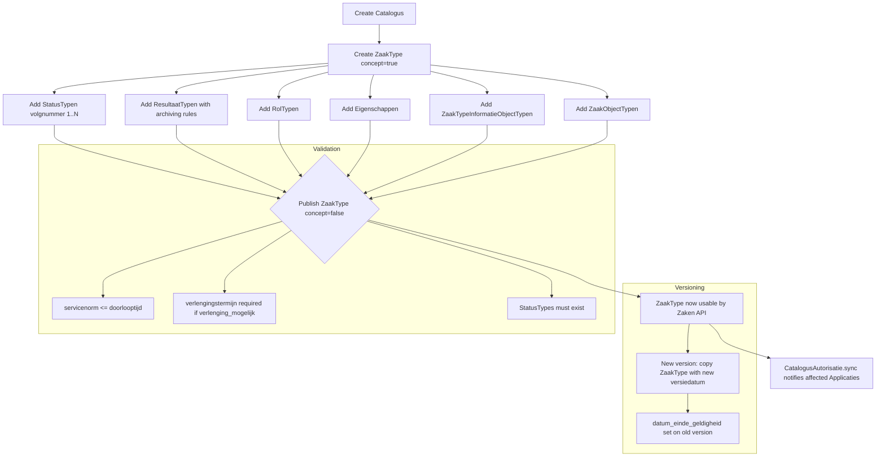

# Catalogi - ZaakTypen Configuration

## Purpose

The Catalogi API is the configuration backbone of OpenZaak. It defines the "types" (templates) for everything: ZaakType, StatusType, ResultaatType, RolType, EigenschapType, BesluitType, InformatieObjectType. Everything in the Zaken, Documenten, and Besluiten APIs must reference a type from the Catalogi.

### Relevance to Procest

Procest uses OpenRegister schemas as its type system. OpenZaak's Catalogi model is far more structured, with versioning, publication status (concept/published), validity periods, and cross-type relationships. Understanding this is critical for competitive analysis.

## Architecture

The Catalogi is organized as a hierarchy:
- **Catalogus** (top-level container, unique per domein+RSIN)
  - **ZaakType** (case type definition)
    - **StatusType** (ordered status definitions with CheckListItems)
    - **ResultaatType** (result types with archiving rules)
    - **RolType** (role types: initiator, behandelaar, etc.)
    - **Eigenschap** (custom properties with EigenschapSpecificatie)
    - **ZaakObjectType** (related object types)
    - **ZaakTypenRelatie** (relations to other zaaktypen)
    - **ZaakTypeInformatieObjectType** (junction to document types)
  - **BesluitType** (decision type, M2M to ZaakType)
  - **InformatieObjectType** (document type, M2M via ZaakTypeInformatieObjectType)

Key patterns:
- **ConceptMixin**: Types start as concept, must be published before use
- **GeldigheidMixin**: Validity periods (datum_begin_geldigheid, datum_einde_geldigheid)
- **SyncAutorisatieManager**: Auto-syncs authorization when types are created

## Data Model - Catalogus

| Field | Type | Required | Description |
|-------|------|----------|-------------|
| uuid | UUID4 | auto | Unique identifier |
| naam | CharField(200) | no | Name of the catalogue |
| domein | CharField(5) | yes | Domain abbreviation (uppercase) |
| rsin | RSIN | yes | Owner organisation RSIN |
| contactpersoon_beheer_naam | CharField(40) | yes | Contact person name |
| contactpersoon_beheer_telefoonnummer | CharField(20) | no | Contact phone |
| contactpersoon_beheer_emailadres | EmailField | no | Contact email |
| versie | CharField(20) | no | Version string |
| begindatum_versie | DateField | no | Version start date |

Unique constraint: (domein, rsin)

## Data Model - ZaakType

| Field | Type | Required | Description |
|-------|------|----------|-------------|
| uuid | UUID4 | auto | Unique identifier |
| identificatie | CharField(50) | auto-gen | Unique ID within catalogus |
| zaaktype_omschrijving | CharField(80) | yes | Description |
| zaaktype_omschrijving_generiek | CharField(80) | no | Generic description |
| vertrouwelijkheidaanduiding | choices | yes | Default confidentiality level |
| doel | TextField | yes | Purpose of this case type |
| aanleiding | TextField | yes | What triggers this case type |
| toelichting | TextField | no | Explanation |
| indicatie_intern_of_extern | choices | yes | Internal/external initiation |
| handeling_initiator | CharField(20) | yes | Initiator verb (aanvragen/indienen/melden) |
| onderwerp | CharField(80) | yes | Subject |
| handeling_behandelaar | CharField(20) | yes | Handler verb (behandelen/uitvoeren) |
| doorlooptijd_behandeling | DurationField | yes | Legal processing duration |
| servicenorm_behandeling | DurationField | no | Service norm duration |
| opschorting_en_aanhouding_mogelijk | BooleanField | yes | Can cases be suspended? |
| verlenging_mogelijk | BooleanField | yes | Can deadline be extended? |
| verlengingstermijn | DurationField | conditional | Extension period (required if verlenging_mogelijk) |
| trefwoorden | ArrayField(CharField) | no | Keywords |
| publicatie_indicatie | BooleanField | yes | Must starting be published? |
| publicatietekst | TextField | no | Publication text template |
| verantwoordingsrelatie | ArrayField | no | Accountability relations |
| versiedatum | DateField | yes | Version date |
| verantwoordelijke | CharField(50) | yes | Responsible unit/person |
| producten_of_diensten | ArrayField(URL) | no | Products/services URLs |
| selectielijst_procestype | URLField | no | Archive selection list process type |
| referentieproces | GegevensGroep | yes(naam) | Reference process (naam + link) |
| catalogus | FK(Catalogus) | yes | Parent catalogue |
| concept | BooleanField | yes | Draft status |
| datum_begin_geldigheid | DateField | yes | Validity start |
| datum_einde_geldigheid | DateField | no | Validity end |
| deelzaaktypen | M2M(self) | no | Sub-case types |

## Data Model - StatusType

| Field | Type | Required | Description |
|-------|------|----------|-------------|
| uuid | UUID4 | auto | Unique identifier |
| zaaktype | FK(ZaakType) | yes | Parent case type |
| statustype_omschrijving | CharField(80) | yes | Description |
| statustypevolgnummer | SmallInt(1-9999) | yes | Order number |
| doorlooptijd | DaysDuration | no | Expected duration for this status |
| informeren | BooleanField | default=false | Notify initiator on this status? |
| statustekst | CharField(1000) | no | Notification text |
| toelichting | CharField(1000) | no | Explanation |

The StatusType with the **highest volgnummer** is the "eindstatus" (final status). Setting this status closes the zaak.

### CheckListItem (per StatusType)

| Field | Type | Required | Description |
|-------|------|----------|-------------|
| statustype | FK(StatusType) | yes | Parent status type |
| itemnaam | CharField(30) | yes | Checklist item name |
| vraagstelling | CharField(255) | yes | Question to check |
| verplicht | BooleanField | default=false | Is this check mandatory? |
| toelichting | CharField(1000) | no | Description |

## Data Model - ResultaatType

| Field | Type | Required | Description |
|-------|------|----------|-------------|
| uuid | UUID4 | auto | Unique identifier |
| zaaktype | FK(ZaakType) | yes | Parent case type |
| omschrijving | CharField(30) | yes | Description (e.g., "Verleend", "Geweigerd") |
| resultaattypeomschrijving | URLField | yes | Generic description URL (referentielijst) |
| selectielijstklasse | URLField | yes | Archive selection list class URL |
| archiefnominatie | choices | derived | blijvend_bewaren or vernietigen |
| archiefactietermijn | DurationField | derived | Duration until archive action |
| brondatum_archiefprocedure | GegevensGroep | yes | How to determine the archive start date |
| informatieobjecttypen | M2M | no | Required document types for this result |
| besluittypen | M2M | no | Related decision types |
| zaakobjecttypen | M2M | no | Required object types for this result |

### brondatum_archiefprocedure (GegevensGroep)

| Field | Type | Choices |
|-------|------|---------|
| afleidingswijze | CharField | afgehandeld, hoofdzaak, eigenschap, ander_datumkenmerk, zaakobject, termijn, gerelateerde_zaak, ingangsdatum_besluit, vervaldatum_besluit |
| datumkenmerk | CharField(80) | attribute name on procesobject |
| einddatum_bekend | BooleanField | must end date be known before closing? |
| objecttype | CharField(80) | ZaakobjectType |
| registratie | CharField(80) | registry name |
| procestermijn | DurationField | process term duration |

## Data Model - Other Types

### RolType
- zaaktype FK, omschrijving, omschrijving_generiek (choices: adviseur, behandelaar, belanghebbende, beslisser, initiator, klantcontacter, zaakcoordinator, mede_initiator)

### Eigenschap + EigenschapSpecificatie
- Custom properties per ZaakType with formaat (tekst/getal/datum/datum_tijd), lengte, kardinaliteit, waardenverzameling

### ZaakObjectType
- Links ZaakType to external object types with relatie_omschrijving

### ZaakTypeInformatieObjectType
- Junction between ZaakType and InformatieObjectType with volgnummer and richting (inkomend/intern/uitgaand)

### ZaakTypenRelatie
- Links ZaakType to other ZaakTypes with aard_relatie (bijdrage/onderwerp/vervolg)

## API Endpoints

| Method | Path | Scope | Description |
|--------|------|-------|-------------|
| GET/POST | /catalogi/v1/catalogussen | catalogi.lezen/schrijven | CRUD catalogues |
| GET/POST | /catalogi/v1/zaaktypen | catalogi.lezen/schrijven | CRUD case types |
| GET/POST | /catalogi/v1/statustypen | catalogi.lezen/schrijven | CRUD status types |
| GET/POST | /catalogi/v1/resultaattypen | catalogi.lezen/schrijven | CRUD result types |
| GET/POST | /catalogi/v1/roltypen | catalogi.lezen/schrijven | CRUD role types |
| GET/POST | /catalogi/v1/eigenschappen | catalogi.lezen/schrijven | CRUD properties |
| GET/POST | /catalogi/v1/informatieobjecttypen | catalogi.lezen/schrijven | CRUD document types |
| GET/POST | /catalogi/v1/besluittypen | catalogi.lezen/schrijven | CRUD decision types |
| GET/POST | /catalogi/v1/zaaktype-informatieobjecttypen | catalogi.lezen/schrijven | CRUD junctions |
| GET/POST | /catalogi/v1/zaakobjecttypen | catalogi.lezen/schrijven | CRUD object types |

Special scopes:
- `catalogi.geforceerd-schrijven`: Modify published (non-concept) types
- `catalogi.geforceerd-verwijderen`: Delete published types

## Business Logic

## Procest Comparison

| Feature | Already in Procest | Not yet in Procest |
|---------|-------------------|-------------------|
| Case type definitions | Partial (OpenRegister schemas) | Full ZaakType with all metadata |
| Concept/published workflow | No | ConceptMixin draft/publish |
| Validity periods | No | GeldigheidMixin with begin/einde dates |
| Status type ordering | No | Ordered StatusTypes with volgnummer |
| Checklist items per status | No | CheckListItem model |
| Result types with archiving | No | Full ResultaatType with selectielijst |
| Role types | No | RolType with generieke omschrijving |
| Custom properties (Eigenschap) | Partial (JSON properties) | Typed EigenschapSpecificatie |
| Document type configuration | No | InformatieObjectType + junction |
| Decision type configuration | No | BesluitType with reactietermijn |
| Type versioning | No | versiedatum + geldigheid |
| Cross-type relations | No | ZaakTypenRelatie |
| Processing duration config | No | doorlooptijd_behandeling + servicenorm |
| Suspension/extension config | No | opschorting_en_aanhouding_mogelijk + verlenging_mogelijk |
| Selectielijst integration | No | selectielijst_procestype URL reference |
| Auto-sync authorisations on type creation | No | CatalogusAutorisatie.sync |
