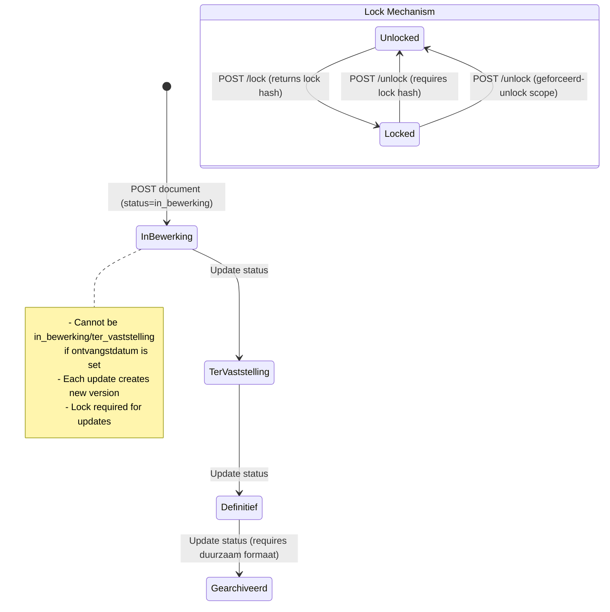

# Documenten API (DRC)

## Purpose

The Documenten API manages EnkelvoudigInformatieObjecten (documents) -- the official term for any information object in a case dossier. It supports versioning, locking, chunked uploads (BestandsDelen), usage rights (Gebruiksrechten), and dispatch tracking (Verzending).

### Relevance to Procest

Document management is essential for case handling. OpenZaak's implementation includes advanced features like document locking, multi-part uploads, versioning, and cross-referencing to both cases and decisions.

## Architecture

The document model uses a **canonical + version** pattern:
- `EnkelvoudigInformatieObjectCanonical` holds the identity and lock state
- `EnkelvoudigInformatieObject` holds the actual content (multiple versions per canonical)
- Latest version is determined by ordering on `versie` descending

File storage uses `PrivateMediaFileField` (django-privates) with configurable backend (`documenten_storage`).

## Data Model - EnkelvoudigInformatieObject

| Field | Type | Required | Description |
|-------|------|----------|-------------|
| uuid | UUID4 | auto | Unique identifier |
| canonical | FK(Canonical) | yes | Identity reference |
| identificatie | CharField(40) | auto-gen | Document identifier |
| bronorganisatie | RSIN(9) | yes | Source organisation |
| creatiedatum | DateField | yes | Creation date |
| titel | CharField(200) | yes | Document title |
| vertrouwelijkheidaanduiding | choices | yes | Confidentiality level |
| auteur | CharField(200) | yes | Author |
| status | choices | no | in_bewerking / ter_vaststelling / definitief / gearchiveerd |
| beschrijving | TextField(1000) | no | Description |
| ontvangstdatum | DateField | no | Receipt date (required for external docs) |
| verzenddatum | DateField | no | Send date |
| indicatie_gebruiksrecht | BooleanField | nullable | Usage rights indicator |
| ondertekening | GegevensGroep | no | Signature (soort + datum) |
| informatieobjecttype | FkOrServiceUrl | yes | Reference to InformatieObjectType |
| formaat | CharField(255) | no | MIME type |
| taal | CharField(3) | yes | ISO 639-2/B language code |
| bestandsnaam | CharField(255) | no | Filename with extension |
| bestandsomvang | BigIntField | no | File size in bytes |
| inhoud | PrivateMediaFile | no | File content |
| link | URLField | no | URL to content |
| integriteit | GegevensGroep | no | Checksum (algoritme, waarde, datum) |
| versie | PositiveIntField | default=1 | Version number |
| begin_registratie | DateTimeField | auto | Registration timestamp |
| verschijningsvorm | TextField | no | Presentation aspects |
| trefwoorden | ArrayField | no | Keywords |

### Canonical (Lock mechanism)

| Field | Type | Description |
|-------|------|-------------|
| lock | CharField(100) | Lock hash (empty = unlocked) |

### BestandsDeel (Chunked uploads)

| Field | Type | Description |
|-------|------|-------------|
| uuid | UUID4 | Unique identifier |
| informatieobject | FK(Canonical) | Document reference |
| volgnummer | PositiveInt | Part sequence number |
| omvang | BigIntField | Expected chunk size |
| inhoud | PrivateMediaFile | Chunk content |
| _voltooid | BooleanField | Upload complete flag |

### Gebruiksrechten (Usage rights)

| Field | Type | Description |
|-------|------|-------------|
| uuid | UUID4 | Unique identifier |
| informatieobject | FK(Canonical) | Document reference |
| omschrijving_voorwaarden | TextField | Usage conditions |
| startdatum | DateTimeField | Start of rights period |
| einddatum | DateTimeField | End of rights period |

### ObjectInformatieObject (Cross-references)

| Field | Type | Description |
|-------|------|-------------|
| uuid | UUID4 | Unique identifier |
| informatieobject | FK(Canonical) | Document reference |
| object_type | choices | zaak / besluit / verzoek |
| zaak | FkOrServiceUrl | Case reference (mutex with besluit) |
| besluit | FkOrServiceUrl | Decision reference (mutex with zaak) |

### Verzending (Dispatch tracking)

| Field | Type | Description |
|-------|------|-------------|
| uuid | UUID4 | Unique identifier |
| betrokkene | URLField | Person reference |
| informatieobject | FK(Canonical) | Document reference |
| aard_relatie | choices | afzender / geadresseerde |
| contact_persoon | URLField | Contact person |
| ontvangstdatum / verzenddatum | DateField | Receipt/send date |
| Various address fields | | Binnenlands/buitenlands correspondence address |

## API Endpoints

| Method | Path | Scope | Description |
|--------|------|-------|-------------|
| GET/POST | /documenten/v1/enkelvoudiginformatieobjecten | documenten.lezen/aanmaken | CRUD documents |
| GET/PUT/PATCH | /documenten/v1/enkelvoudiginformatieobjecten/{uuid} | documenten.lezen/bijwerken | Detail + update |
| DELETE | /documenten/v1/enkelvoudiginformatieobjecten/{uuid} | documenten.verwijderen | Delete document |
| POST | /documenten/v1/enkelvoudiginformatieobjecten/{uuid}/lock | documenten.lock | Lock document |
| POST | /documenten/v1/enkelvoudiginformatieobjecten/{uuid}/unlock | documenten.lock | Unlock document |
| GET/PUT | /documenten/v1/bestandsdelen/{uuid} | documenten.bijwerken | Upload chunk |
| GET/POST | /documenten/v1/gebruiksrechten | documenten.lezen/aanmaken | Usage rights |
| GET | /documenten/v1/objectinformatieobjecten | documenten.lezen | Cross-references |
| GET/POST | /documenten/v1/verzendingen | documenten.lezen/aanmaken | Dispatch tracking |
| POST | /documenten/v1/documentnummer_reserveren | documenten.aanmaken | Reserve number |
| POST | /documenten/v1/document_registreren | documenten.aanmaken | Register document (batch) |
| POST | /documenten/v1/import/create | documenten.aanmaken | Bulk import |

## Business Logic

## Procest Comparison

| Feature | Already in Procest | Not yet in Procest |
|---------|-------------------|-------------------|
| Document storage | Via Nextcloud files | -- |
| Document versioning | No | Canonical + version model |
| Document locking | No | Lock/unlock with hash |
| Chunked upload | No | BestandsDelen multi-part upload |
| Usage rights | No | Gebruiksrechten model |
| Dispatch tracking | No | Verzending model with addresses |
| Document status lifecycle | No | in_bewerking -> definitief -> gearchiveerd |
| Cross-referencing (zaak+besluit) | No | ObjectInformatieObject with mutex |
| Integrity checksums | No | integriteit GegevensGroep |
| Bulk import | No | Import endpoint with status tracking |
| Document number reservation | No | documentnummer_reserveren |
| Confidentiality on documents | No | VertrouwelijkheidsAanduiding |
| InformatieObjectType reference | No | Typed documents via Catalogi |
