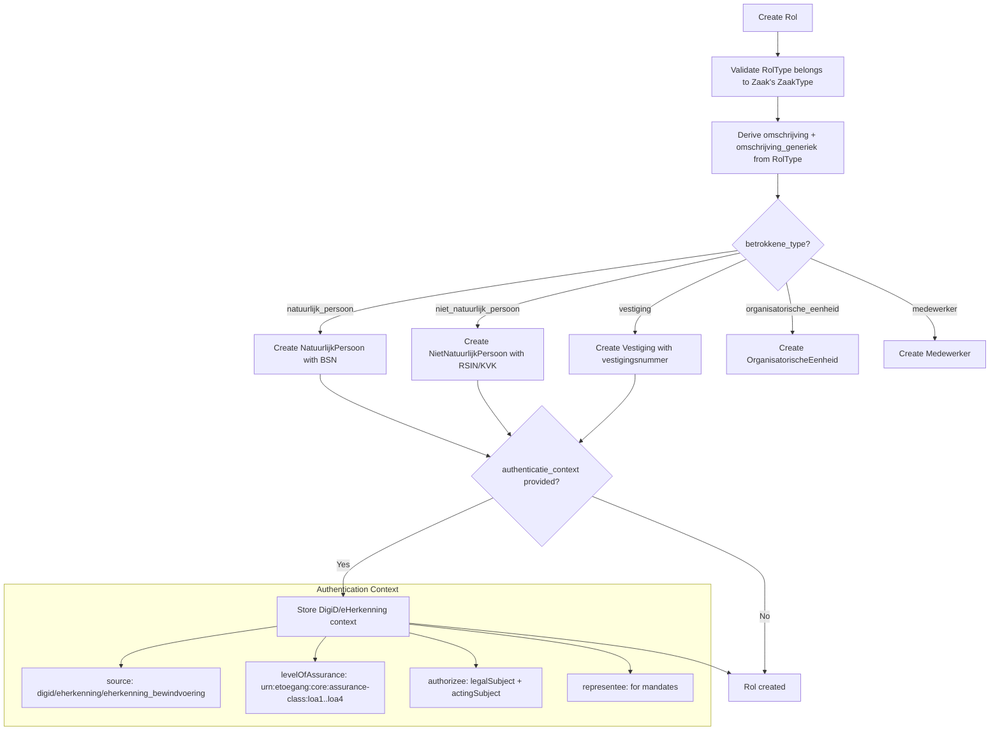

# Rollen & Betrokkenen

## Purpose

Roles (Rollen) define how people and organisations are involved in a case. Each Rol links a Betrokkene (involved party) to a Zaak via a RolType. The Betrokkene can be a natural person (BSN), legal entity (RSIN/KVK), establishment (vestiging), organisational unit, or employee.

### Relevance to Procest

Case handling always involves multiple parties: the initiator (citizen/business), the handler (case worker), advisors, decision-makers. Procest needs a role system to track who is involved in what capacity.

## Data Model - Rol

| Field | Type | Required | Description |
|-------|------|----------|-------------|
| uuid | UUID4 | auto | Unique identifier |
| zaak | FK(Zaak) | yes | Case reference |
| betrokkene | URLField(1000) | no | URL reference to involved party |
| betrokkene_type | choices | yes | Type: natuurlijk_persoon, niet_natuurlijk_persoon, vestiging, organisatorische_eenheid, medewerker |
| roltype | FkOrServiceUrl | yes | Reference to RolType |
| omschrijving | CharField(100) | derived | Description from RolType |
| omschrijving_generiek | choices | derived | Generic role: adviseur, behandelaar, belanghebbende, beslisser, initiator, klantcontacter, zaakcoordinator, mede_initiator |
| roltoelichting | TextField(1000) | no | Role explanation |
| afwijkende_naam_betrokkene | TextField(625) | no | Alternative name |
| registratiedatum | DateTimeField | auto | Registration timestamp |
| indicatie_machtiging | choices | no | Mandate indication (gemachtigde/machtiginggever) |
| contactpersoon_rol | GegevensGroep | no | Contact person (naam, emailadres, functie, telefoonnummer) |
| authenticatie_context | JSONField | no | DigiD/eHerkenning authentication context |
| begin_geldigheid | DateField | no | Validity start (experimental) |
| einde_geldigheid | DateField | no | Validity end (experimental) |

## Data Model - Betrokkene Types

### NatuurlijkPersoon (Natural Person)
| Field | Type | Description |
|-------|------|-------------|
| inp_bsn | BSNField | Citizen service number (indexed) |
| anp_identificatie | CharField(17) | Alternative ID |
| inp_a_nummer | CharField(10) | Administration number |
| geslachtsnaam | CharField(200) | Family name |
| voorvoegsel_geslachtsnaam | CharField(80) | Name prefix |
| voorletters | CharField(20) | Initials |
| voornamen | CharField(200) | First names |
| geslachtsaanduiding | choices | Gender (m/v/o) |
| geboortedatum | CharField(18) | Birth date |

### NietNatuurlijkPersoon (Legal Entity)
| Field | Type | Description |
|-------|------|-------------|
| inn_nnp_id | RSINField | RSIN (indexed) |
| ann_identificatie | CharField(17) | Alternative ID (indexed) |
| statutaire_naam | TextField(500) | Statutory name |
| inn_rechtsvorm | choices | Legal form |
| bezoekadres | CharField(1000) | Visit address |
| kvk_nummer | CharField(8) | Chamber of Commerce number |
| vestigings_nummer | CharField(24) | Establishment number (indexed) |

### Vestiging (Establishment)
| Field | Type | Description |
|-------|------|-------------|
| vestigings_nummer | CharField(24) | Establishment number (indexed) |
| handelsnaam | ArrayField(TextField) | Trade names |
| kvk_nummer | CharField(8) | KvK number |

### OrganisatorischeEenheid (Organisational Unit)
| Field | Type | Description |
|-------|------|-------------|
| identificatie | CharField(255) | ID (indexed) |
| naam | CharField(255) | Name |
| is_gehuisvest_in | CharField(255) | Located in |

### Medewerker (Employee)
| Field | Type | Description |
|-------|------|-------------|
| identificatie | CharField(128) | Employee ID (indexed) |
| achternaam | CharField(200) | Last name |
| voorletters | CharField(20) | Initials |
| voorvoegsel_achternaam | CharField(10) | Name prefix |

## API Endpoints

| Method | Path | Scope | Description |
|--------|------|-------|-------------|
| GET/POST | /zaken/v1/rollen | zaken.lezen/aanmaken | CRUD roles |
| GET | /zaken/v1/rollen/{uuid} | zaken.lezen | Retrieve role |
| DELETE | /zaken/v1/rollen/{uuid} | zaken.verwijderen | Delete role |

## Business Logic

## Procest Comparison

| Feature | Already in Procest | Not yet in Procest |
|---------|-------------------|-------------------|
| Role assignment to cases | No | Full Rol model with types |
| Generic role types | No | 8 standard generieke omschrijvingen |
| Natural person (BSN) | No | NatuurlijkPersoon with BSN |
| Legal entity (KVK/RSIN) | No | NietNatuurlijkPersoon |
| Establishment tracking | No | Vestiging with vestigingsnummer |
| Employee tracking | No | Medewerker model |
| Organisational unit | No | OrganisatorischeEenheid |
| DigiD/eHerkenning context | No | authenticatie_context JSON |
| Mandate support | No | indicatie_machtiging + representee |
| Contact person per role | No | contactpersoon_rol GegevensGroep |
| Role validity period | No | begin/einde_geldigheid (experimental) |
| Type validation | No | CorrectZaaktypeValidator |
