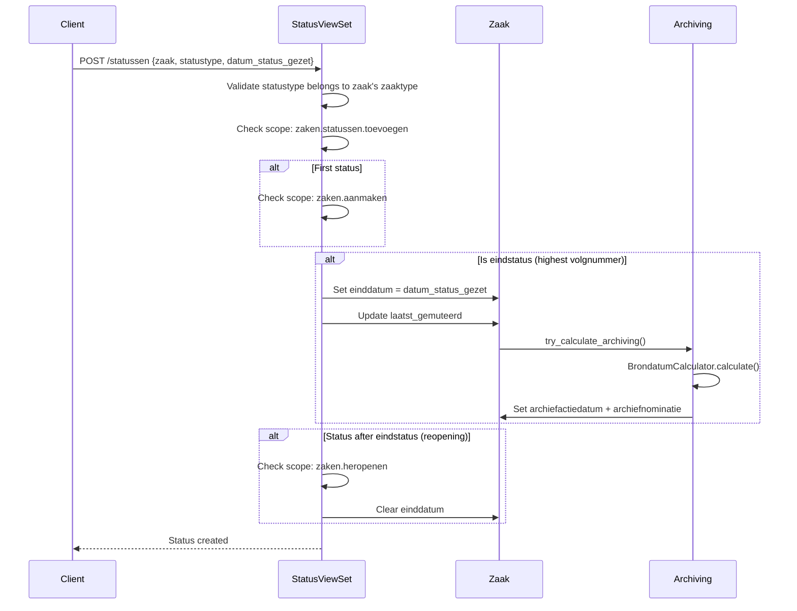
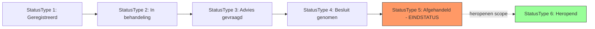

# Status & Resultaat

## Purpose

Status tracks the progression of a case through defined stages. Resultaat records the outcome of a case. Together they control the case lifecycle: status progression leads to closing, and the result determines archiving behavior.

### Relevance to Procest

Status tracking and result recording are fundamental workflow features. The status model includes an interesting SubStatus extension for fine-grained progress tracking.

## Data Model - Status

| Field | Type | Required | Description |
|-------|------|----------|-------------|
| uuid | UUID4 | auto | Unique identifier |
| zaak | FK(Zaak) | yes | Case reference |
| statustype | FkOrServiceUrl | yes | Reference to StatusType |
| datum_status_gezet | DateTimeField | yes | Timestamp when status was set |
| statustoelichting | TextField(1000) | no | Explanation |
| gezetdoor | FK(Rol) | no | Role that set this status |

Key constraints:
- Unique together: (zaak, datum_status_gezet)
- Ordered by: -datum_status_gezet (most recent first)

## Data Model - SubStatus (Experimental)

| Field | Type | Required | Description |
|-------|------|----------|-------------|
| uuid | UUID4 | auto | Unique identifier |
| zaak | FK(Zaak) | yes | Case reference |
| status | FK(Status) | yes | Parent status |
| tijdstip | DateTimeField | default=now | Timestamp |
| omschrijving | TextField(200) | yes | Description |
| doelgroep | choices | default=betrokkenen | Visibility (betrokkenen/behandelaars/intern) |

## Data Model - Resultaat

| Field | Type | Required | Description |
|-------|------|----------|-------------|
| uuid | UUID4 | auto | Unique identifier |
| zaak | OneToOne(Zaak) | yes | Case reference (one result per case) |
| resultaattype | FkOrServiceUrl | yes | Reference to ResultaatType |
| toelichting | TextField(1000) | no | Explanation |

Key constraint: OneToOneField -- a Zaak can have exactly ONE Resultaat.

## Business Logic

### Status Progression

## Key Business Rules

1. **Eindstatus detection**: The StatusType with the highest `statustypevolgnummer` is the eindstatus
2. **Closing on eindstatus**: Setting the eindstatus sets `zaak.einddatum` to the status date
3. **One Resultaat per Zaak**: Enforced by OneToOneField
4. **Resultaat triggers archiving**: When a Resultaat is saved and the Zaak is already closed, archiving is recalculated
5. **StatusType validation**: The StatusType must belong to the Zaak's ZaakType (CorrectZaaktypeValidator)
6. **SubStatus doelgroep**: Controls visibility (betrokkenen sees all, behandelaars for staff, intern for internal)
7. **indicatie_laatst_gezette_status**: Property that indicates if this is the most recent status (uses annotation for performance)

## Procest Comparison

| Feature | Already in Procest | Not yet in Procest |
|---------|-------------------|-------------------|
| Status tracking | Basic | Full Status model with type validation |
| Status ordering | No | StatusType volgnummer ordering |
| Final status detection | No | Automatic eindstatus from highest volgnummer |
| Case closing on final status | No | Auto-set einddatum + archive trigger |
| Case reopening | No | zaken.heropenen scope |
| SubStatus (fine-grained) | No | SubStatus with doelgroep visibility |
| Result recording | No | OneToOne Resultaat per Zaak |
| Result triggers archiving | No | Automatic archive calculation |
| Status set by role | No | gezetdoor FK(Rol) |
| Status timestamp tracking | No | datum_status_gezet with unique constraint |
