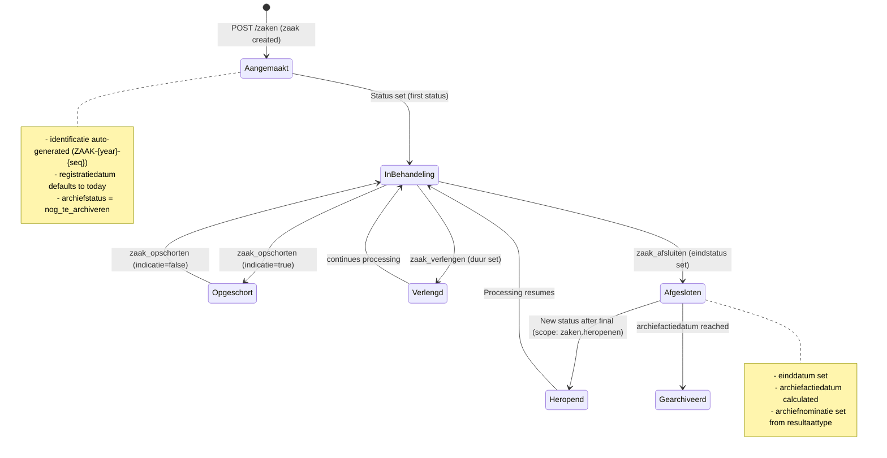

# Zaak Lifecycle

## Purpose

The Zaak (case) is the central entity in OpenZaak. A Zaak represents "a coherent amount of work with a well-defined cause and result, whose quality and throughput must be monitored." The lifecycle covers creation, status progression, suspension, extension, closing, and reopening.

### Relevance to Procest

This is the core of zaakgericht werken -- everything Procest does revolves around case management. Understanding the full lifecycle is essential for feature parity.

## Architecture

OpenZaak implements the Zaak as a Django model inheriting from `ZaakIdentificatie` (separate table for race-condition-safe ID generation using PostgreSQL advisory locks). The Zaak uses `FkOrServiceUrlField` to support both local and external references to ZaakType.

Key design patterns:
- **ETagMixin** for optimistic concurrency control
- **AuditTrailMixin** for full audit logging
- **APIMixin** for URL generation
- Separate ViewSets for distinct lifecycle operations (register, suspend, extend, close, update)

## Data Model

| Field | Type | Required | Description |
|-------|------|----------|-------------|
| uuid | UUID4 | auto | Unique resource identifier |
| identificatie | CharField(40) | auto-gen | Unique ID within bronorganisatie (ZAAK-{year}-{seq}) |
| bronorganisatie | RSIN(9) | yes | Organisation that created the zaak |
| zaaktype | FkOrServiceUrl | yes | Reference to ZaakType (local or external) |
| omschrijving | CharField(80) | no | Short description |
| toelichting | TextField(1000) | no | Explanation |
| registratiedatum | DateField | default=today | Registration date |
| startdatum | DateField | yes | Start date of execution |
| einddatum | DateField | no | Completion date (set on closing) |
| einddatum_gepland | DateField | no | Planned end date |
| uiterlijke_einddatum_afdoening | DateField | no | Legal deadline |
| publicatiedatum | DateField | no | Publication date |
| vertrouwelijkheidaanduiding | choices | yes | Confidentiality level |
| verantwoordelijke_organisatie | RSIN(9) | yes | Responsible organisation |
| hoofdzaak | FK(self) | no | Parent case (deelzaken support) |
| communicatiekanaal | URLField | no | Communication channel reference |
| producten_of_diensten | ArrayField(URL) | no | Products/services |
| betalingsindicatie | choices | no | Payment indication (nvt/nog_niet/gedeeltelijk/geheel) |
| laatste_betaaldatum | DateTimeField | no | Last payment date |
| zaakgeometrie | GeometryField | no | Point/line/polygon geometry |
| selectielijstklasse | URLField | no | Archive selection list class |
| archiefnominatie | choices | no | Archive nomination (blijvend_bewaren/vernietigen) |
| archiefstatus | choices | default=nog_te_archiveren | Archive status |
| archiefactiedatum | DateField | no | Date for archive action |
| opschorting | GegevensGroep | no | Suspension (indicatie, reden, eerdere_opschorting) |
| verlenging | GegevensGroep | no | Extension (reden, duur) |
| processobject | GegevensGroep | no | Process object reference |

## API Endpoints

| Method | Path | ViewSet | Scope | Description |
|--------|------|---------|-------|-------------|
| GET | /zaken/v1/zaken | ZaakViewSet | zaken.lezen | List cases |
| POST | /zaken/v1/zaken | ZaakViewSet | zaken.aanmaken | Create case |
| GET | /zaken/v1/zaken/{uuid} | ZaakViewSet | zaken.lezen | Retrieve case |
| PUT | /zaken/v1/zaken/{uuid} | ZaakViewSet | zaken.bijwerken | Full update |
| PATCH | /zaken/v1/zaken/{uuid} | ZaakViewSet | zaken.bijwerken | Partial update |
| DELETE | /zaken/v1/zaken/{uuid} | ZaakViewSet | zaken.verwijderen | Delete case |
| POST | /zaken/v1/zaak_registreren | ZaakRegistrerenViewset | zaken.aanmaken | Register case (batch) |
| POST | /zaken/v1/zaak_opschorten/{uuid} | ZaakOpschortenViewset | zaken.bijwerken | Suspend case |
| POST | /zaken/v1/zaak_afsluiten/{uuid} | ZaakAfsluitenViewSet | zaken.bijwerken | Close case |
| POST | /zaken/v1/zaak_bijwerken/{uuid} | ZaakBijwerkenViewset | zaken.bijwerken | Update case |
| POST | /zaken/v1/zaak_verlengen/{uuid} | ZaakVerlengenViewset | zaken.bijwerken | Extend case |
| POST | /zaken/v1/zaaknummer_reserveren | ReserveerZaakNummerViewSet | zaken.aanmaken | Reserve case number |

## Business Logic

## Key Business Rules

1. **Identification Generation**: Uses PostgreSQL advisory locks for thread-safe sequential ID generation (ZAAK-{year}-{seq10digits})
2. **Deelzaken**: A zaak can be a deelzaak (sub-case) of a hoofdzaak. Deelzaken of deelzaken are NOT supported.
3. **Suspension**: Sets `opschorting_indicatie=true` and tracks `eerdere_opschorting` (read-only, auto-set)
4. **Extension**: Requires `verlenging_mogelijk=true` on the ZaakType
5. **Closing**: Setting the final status (highest volgnummer StatusType) sets `einddatum` and triggers archive calculation
6. **Reopening**: Requires scope `zaken.heropenen` to create new statuses after the final one
7. **Forced update**: Scope `zaken.geforceerd-bijwerken` allows modifying closed cases
8. **Payment tracking**: `betalingsindicatie=nvt` auto-clears `laatste_betaaldatum`

## Procest Comparison

| Feature | Already in Procest | Not yet in Procest |
|---------|-------------------|-------------------|
| Basic case CRUD | Yes (via OpenRegister objects) | -- |
| Auto-generated identification | No | ZAAK-{year}-{seq} with advisory locks |
| ZaakType reference | Partial (schema-based) | FkOrServiceUrl for external catalogi |
| Deelzaken (sub-cases) | No | hoofdzaak/deelzaken hierarchy |
| Case suspension (opschorting) | No | Full opschorting with tracking |
| Case extension (verlenging) | No | Verlenging with duration |
| Case closing workflow | No | Dedicated afsluiten endpoint + archiving |
| Case reopening | No | zaken.heropenen scope |
| Geometry support | No | PostGIS GeometryField |
| Payment tracking | No | betalingsindicatie + laatste_betaaldatum |
| ETag concurrency | No | Full ETag support |
| Audit trail | No | Complete audit trail per zaak |
| Batch registration | No | zaak_registreren endpoint |
| Number reservation | No | zaaknummer_reserveren endpoint |
| Confidentiality levels | No | VertrouwelijkheidsAanduiding with authorization |
