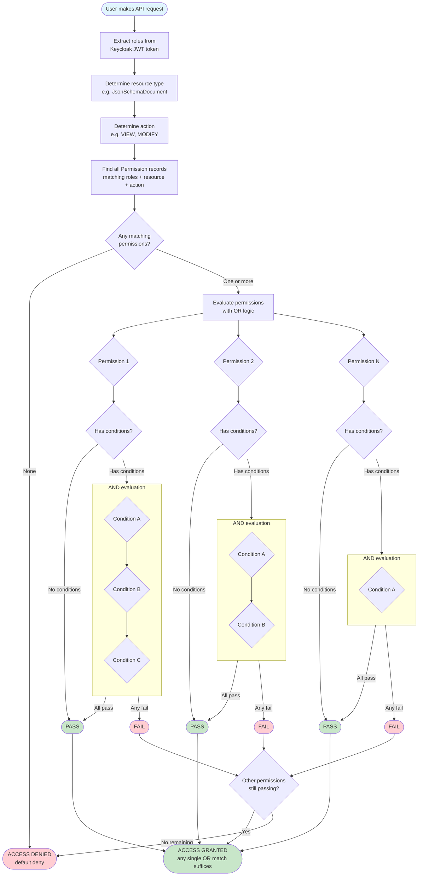
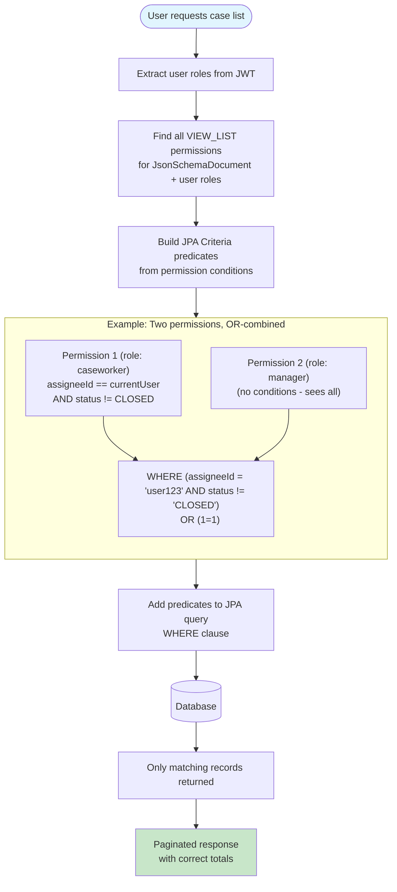
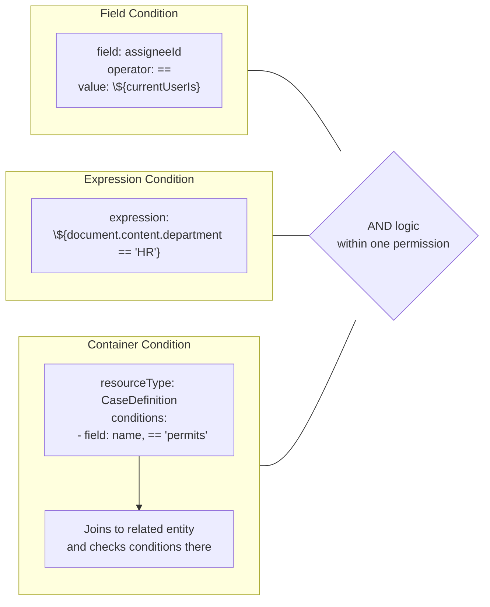
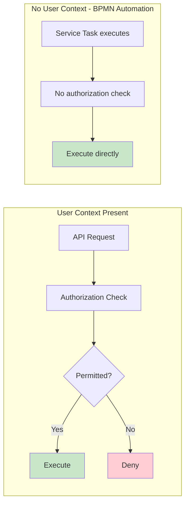

# Authorization Flow -- Valtimo PBAC

## Permission Evaluation Flow

## Query-Level Filtering (List Endpoints)

## Condition Types

## BPMN Bypass Rule

## Key Design Decisions

| Decision | Rationale |
|----------|-----------|
| Deny-by-default | Security-first: no access without explicit permission |
| OR between permissions | Any valid permission is sufficient (least-restrictive wins) |
| AND within conditions | All conditions on a single permission must be met |
| Query-level enforcement | Performance: filter at DB level, not in application |
| BPMN bypass | Automated tasks have no user context; blocking would break processes |
| Keycloak role sync | Single source of truth for identity; Valtimo mirrors roles |
