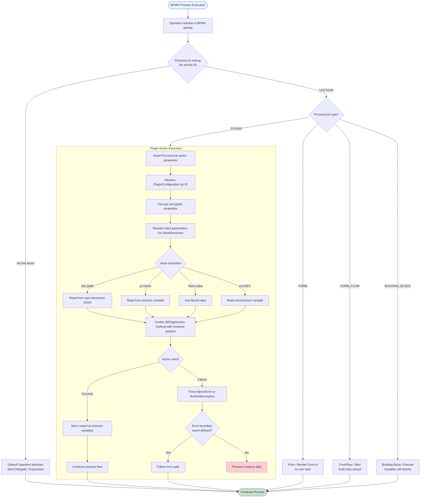
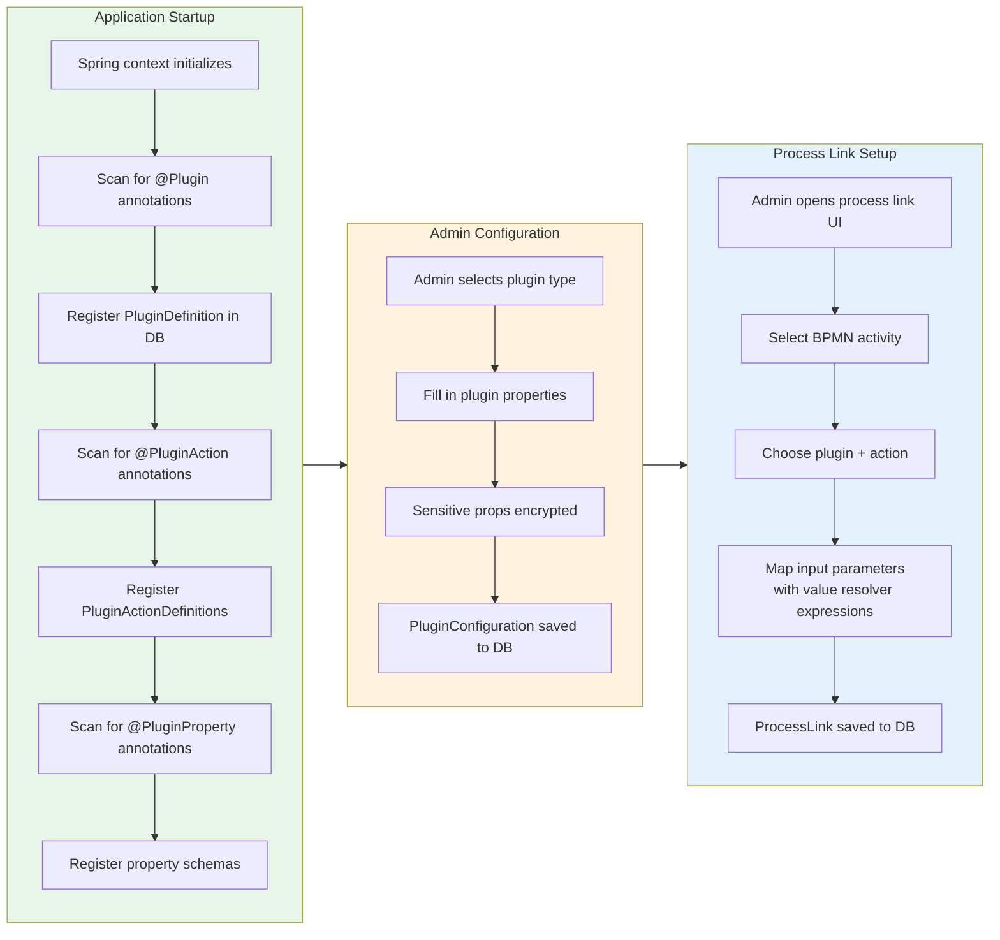

# Plugin Action Flow -- Valtimo

## How Plugins Are Triggered from BPMN



## Plugin Discovery and Registration



## Plugin Lifecycle Events

```mermaid
flowchart LR
    CREATE[Config Created] -->|@PluginEvent CREATED| SETUP[Run setup logic\ne.g. register webhook]
    UPDATE[Config Updated] -->|@PluginEvent UPDATED| REFRESH[Refresh connections\ne.g. re-auth]
    DELETE[Config Deleted] -->|@PluginEvent DELETED| CLEANUP[Run teardown\ne.g. unregister webhook]
```

## Example: ZGW Zaken API Plugin Action

```
BPMN Service Task: "Create Zaak"
  |
  +-- ProcessLink: plugin action
  |     pluginConfigId: "zaken-api-config-1"
  |     actionKey: "create-zaak"
  |     inputs:
  |       zaakTypeUrl: "https://catalogi.example.nl/api/v1/zaaktypen/abc-123"
  |       startDate: "pv:requestDate"
  |       description: "doc:/request/summary"
  |
  +-- Runtime:
        1. Resolve "zaken-api-config-1" -> base URL, auth config
        2. Decrypt OpenZaak credentials
        3. Resolve "pv:requestDate" -> "2026-03-13"
        4. Resolve "doc:/request/summary" -> "Vergunning aanvraag bouwwerk"
        5. POST to Zaken API -> zaak created
        6. Store zaak URL as process variable "zaakUrl"
```
