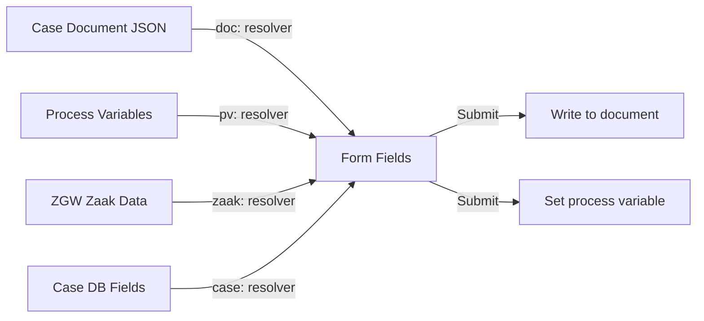

# Process Execution Flow -- Valtimo

## BPMN Process to Task Assignment Flow

```mermaid
flowchart TD
    TRIGGER([Process Start Trigger]) --> TYPE{Start type?}
    TYPE -->|Case creation| CASE_CREATE[Create JsonSchemaDocument]
    TYPE -->|Manual start| MANUAL[User clicks 'Start Process']
    TYPE -->|Message event| MESSAGE[Message correlation]
    TYPE -->|Timer event| TIMER[Scheduled trigger]

    CASE_CREATE --> INSTANTIATE
    MANUAL --> INSTANTIATE
    MESSAGE --> INSTANTIATE
    TIMER --> INSTANTIATE

    INSTANTIATE[Operaton creates process instance] --> BRIDGE[ProcessDocumentInstance link created]
    BRIDGE --> EXECUTE

    EXECUTE[Execute current BPMN element] --> ELEMENT{Element type?}

    ELEMENT -->|Service Task| SERVICE
    ELEMENT -->|User Task| USER
    ELEMENT -->|Gateway| GATEWAY
    ELEMENT -->|Timer Event| TIMER_WAIT
    ELEMENT -->|End Event| END_EVENT
    ELEMENT -->|Call Activity| CALL
    ELEMENT -->|Send Task| SEND

    SERVICE[Service Task] --> PROC_LINK_S{ProcessLink\nexists?}
    PROC_LINK_S -->|Plugin action| RESOLVE_PLUGIN[Resolve plugin configuration]
    RESOLVE_PLUGIN --> RESOLVE_PARAMS[Resolve parameters via ValueResolvers]
    RESOLVE_PARAMS --> EXEC_ACTION[Execute plugin action]
    EXEC_ACTION --> STORE_OUTPUT[Store output as process variables]
    STORE_OUTPUT --> NEXT
    PROC_LINK_S -->|Java Delegate| DELEGATE[Execute Java/Kotlin delegate class]
    DELEGATE --> NEXT

    USER[User Task] --> ASSIGNMENT{Assignment type?}
    ASSIGNMENT -->|Fixed user| ASSIGN_FIXED[Assign to specific user]
    ASSIGNMENT -->|Candidate group| ASSIGN_GROUP[Available to group members]
    ASSIGNMENT -->|Expression| ASSIGN_EXPR[Evaluate ${assignee} expression]

    ASSIGN_FIXED --> TASK_CREATED[Task created in Operaton]
    ASSIGN_GROUP --> TASK_CREATED
    ASSIGN_EXPR --> TASK_CREATED

    TASK_CREATED --> PROC_LINK_T{ProcessLink type?}
    PROC_LINK_T -->|FORM| LOAD_FORM[Load Form.io definition]
    PROC_LINK_T -->|FORM_FLOW| LOAD_FLOW[Load FormFlow definition]
    PROC_LINK_T -->|None| BASIC_COMPLETE[Basic task completion]

    LOAD_FORM --> PREFILL[Prefill via ValueResolvers]
    PREFILL --> RENDER_FORM[Render form to user]
    RENDER_FORM --> SUBMIT[User submits form]
    SUBMIT --> WRITE_BACK[Write values via ValueResolvers]
    WRITE_BACK --> COMPLETE_TASK

    LOAD_FLOW --> WIZARD[Multi-step wizard execution]
    WIZARD --> COMPLETE_TASK

    BASIC_COMPLETE --> COMPLETE_TASK
    COMPLETE_TASK[Complete task in Operaton] --> NEXT

    GATEWAY{Gateway type?} --> EXCLUSIVE{Exclusive?}
    GATEWAY --> PARALLEL{Parallel?}
    GATEWAY --> INCLUSIVE{Inclusive?}
    EXCLUSIVE --> EVAL_COND[Evaluate conditions on sequence flows]
    EVAL_COND --> NEXT
    PARALLEL --> FORK[Fork into parallel paths]
    FORK --> EXECUTE
    INCLUSIVE --> EVAL_INCL[Evaluate all matching paths]
    EVAL_INCL --> NEXT

    TIMER_WAIT[Wait for timer expiry] --> JOB[Operaton Job Executor fires]
    JOB --> NEXT

    CALL[Call Activity] --> SUB[Start sub-process]
    SUB --> SUB_EXEC[Sub-process executes independently]
    SUB_EXEC --> SUB_END[Sub-process ends]
    SUB_END --> NEXT

    SEND[Send Task] --> SEND_EXEC[Execute send action]
    SEND_EXEC --> NEXT

    NEXT[Move to next BPMN element] --> EXECUTE

    END_EVENT[End Event] --> PROC_END[Process instance completed]
    PROC_END --> UNLINK[ProcessDocumentInstance marked inactive]
    UNLINK --> DONE([Process Complete])

    style TRIGGER fill:#e1f5fe
    style DONE fill:#c8e6c9
    style TASK_CREATED fill:#fff9c4
    style RENDER_FORM fill:#fff9c4
    style WIZARD fill:#fff9c4
```

## Process Variable Flow



## Key Characteristics

- **Synchronous service tasks**: Plugin actions execute synchronously within the process transaction
- **Asynchronous user tasks**: Process waits until a user completes the task
- **Timer precision**: Depends on Operaton job executor polling interval
- **Error handling**: BPMN error boundary events catch failures from service tasks
- **Transaction boundary**: Each BPMN wait state (user task, timer, message) is a transaction boundary
