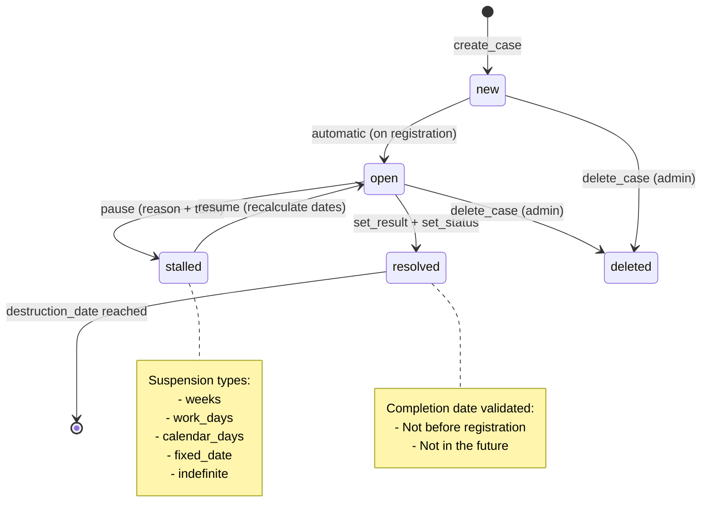
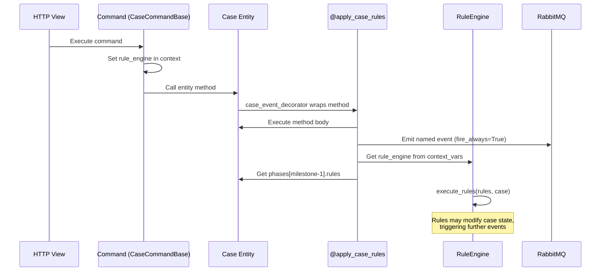
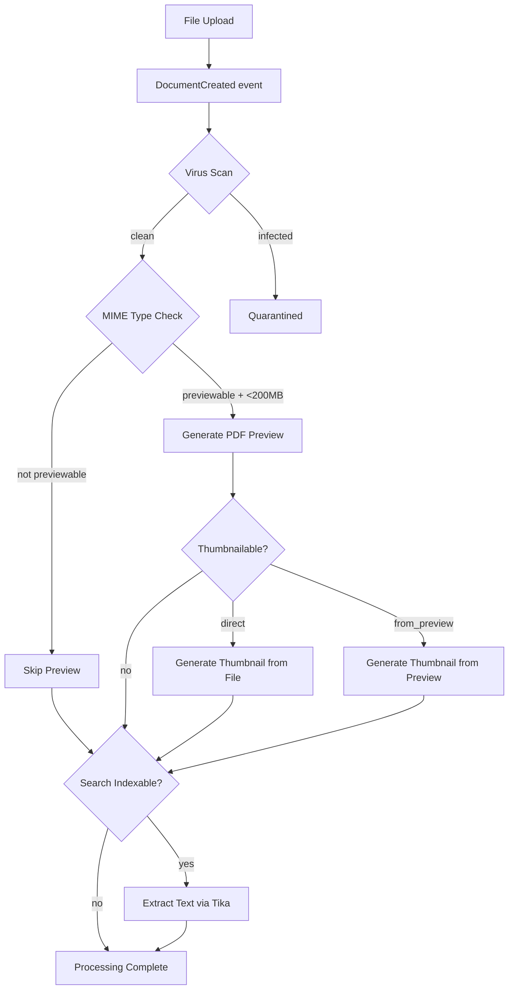
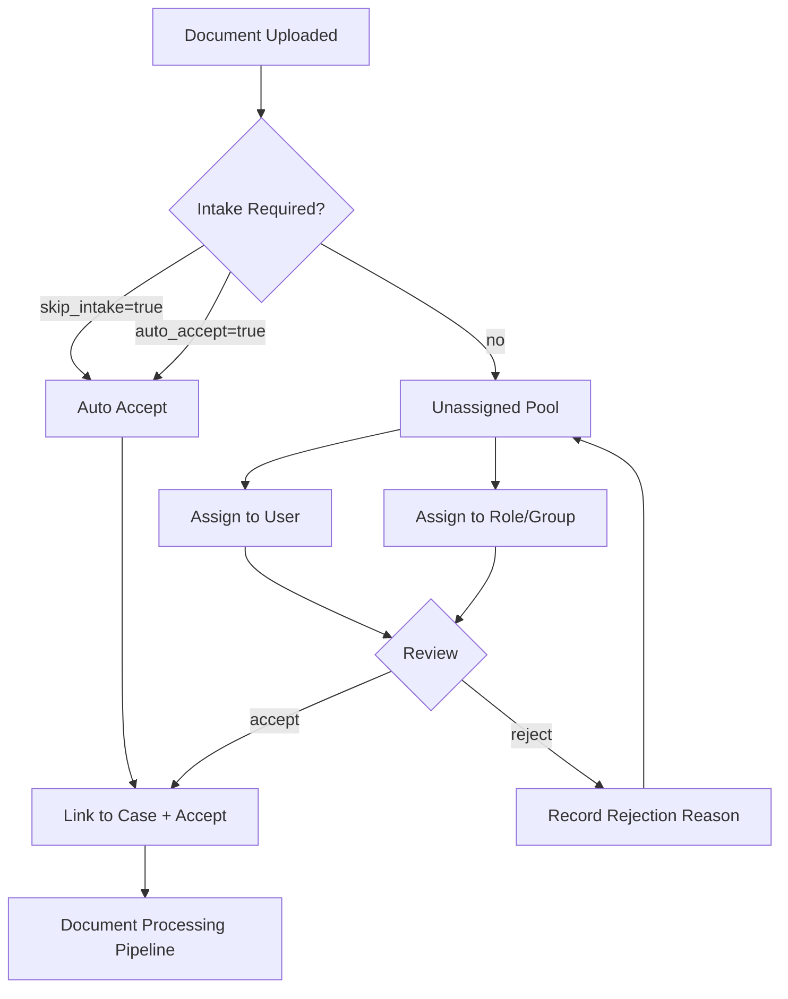
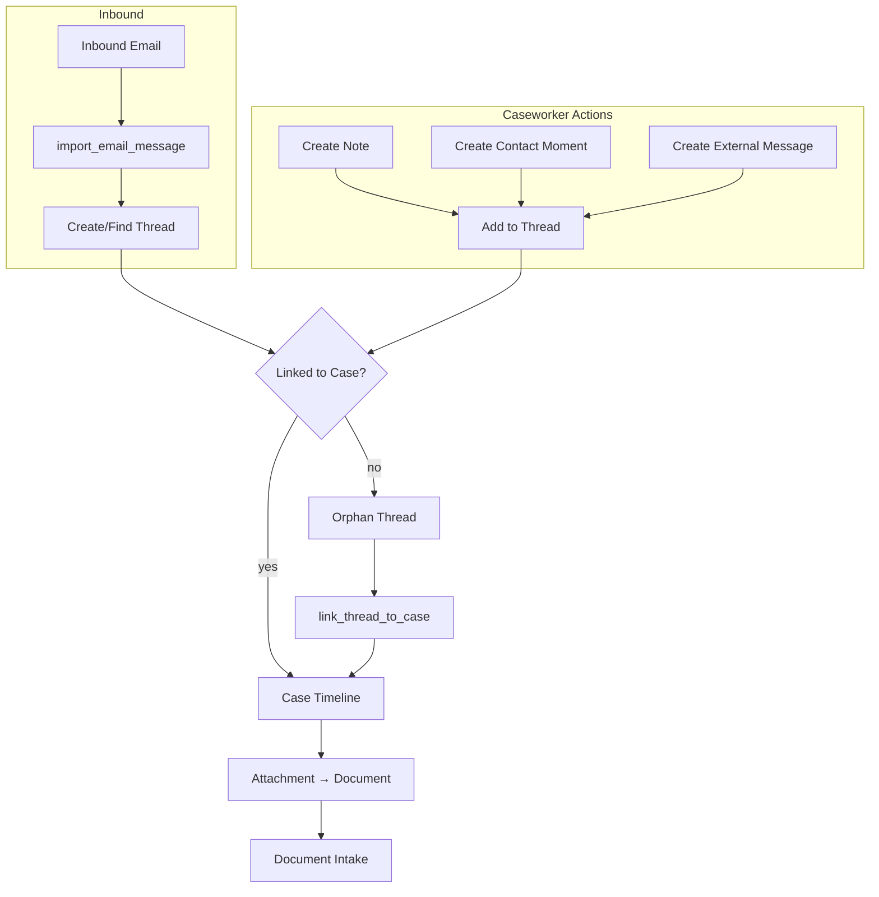
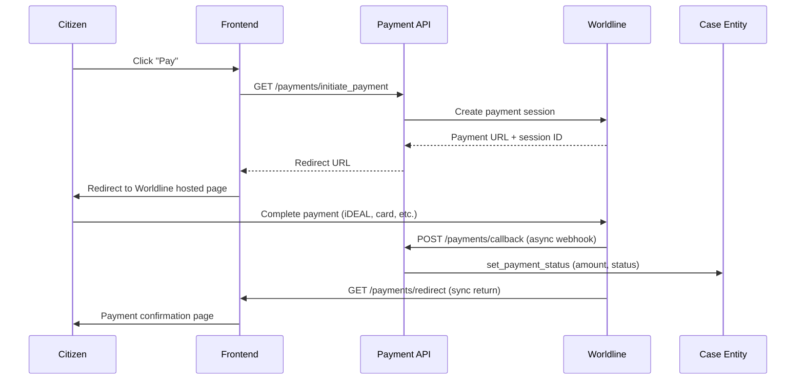
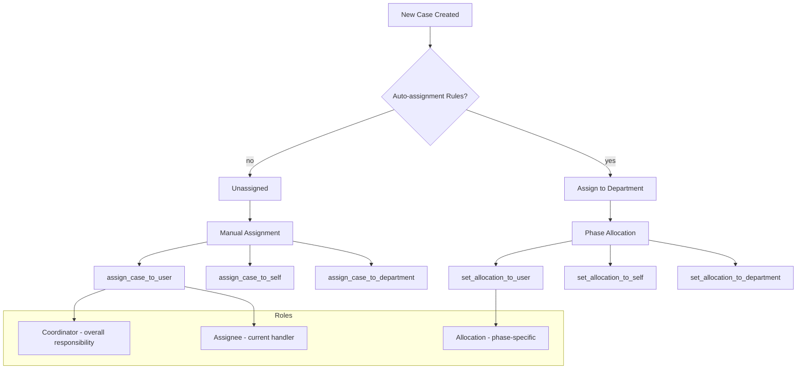
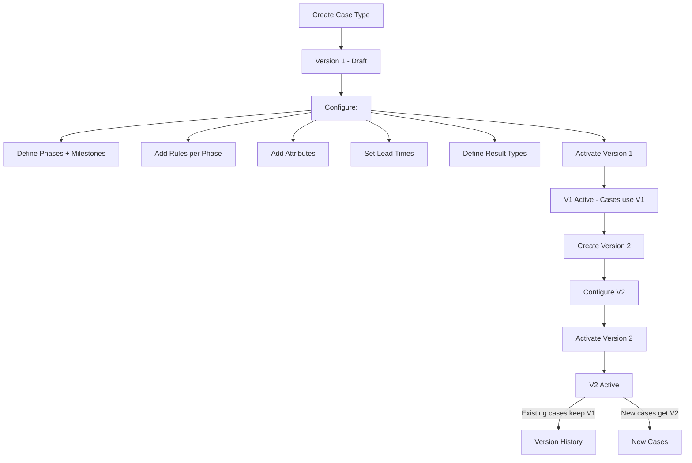

# xxllnc Zaken -- Business Logic Flows

Mermaid diagrams documenting the key business logic flows observed in the codebase.

## 1. Case Lifecycle State Machine



## 2. Case Phase & Rule Engine Flow



## 3. Document Processing Pipeline



## 4. Document Intake Workflow



## 5. Communication Thread Flow



## 6. Payment Flow



## 7. Case Assignment & Allocation



## 8. Event Sourcing & Audit Trail

```mermaid
flowchart TD
    subgraph "Command Execution"
        Cmd[Command] --> Entity[Entity Method]
        Entity --> |@event decorator| Event[Named Event]
    end

    Event --> Exchange[RabbitMQ Exchange: minty_exchange]

    subgraph "Fan-out to Consumers"
        Exchange --> Logger[Logging Consumer<br/>→ audit_log table]
        Exchange --> CaseConsumer[Case Events Consumer<br/>→ integration sync]
        Exchange --> DocConsumer[Document Consumer<br/>→ preview/thumbnail/search]
        Exchange --> CommConsumer[Communication Consumer<br/>→ message processing]
        Exchange --> GeoConsumer[Geo Consumer<br/>→ feature sync]
        Exchange --> NotifyConsumer[Notification Consumer<br/>→ email dispatch]
        Exchange --> JobsConsumer[Jobs Consumer<br/>→ batch processing]
    end
```

## 9. Case Type Version Management


