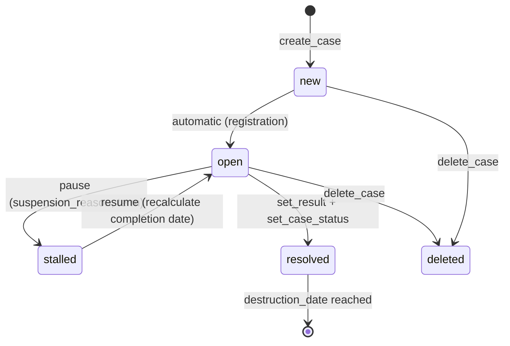

# Case Management -- xxllnc Zaken

## Purpose

Core domain of the zaaksysteem -- manages the full lifecycle of government cases (zaken) from creation through resolution and archival. This is the largest and most complex domain in the system.

## Architecture Overview

- **HTTP Service:** `zsnl_case_management_http` (Pyramid, path `/api/v2/cm/`)
- **Domain:** `zsnl_domains/case_management/`
- **Pattern:** CQRS with Event Sourcing via Minty framework
- **Database:** PostgreSQL (shared)
- **Events:** Published to RabbitMQ, consumed by `zsnl_case_events_consumer`

The case management service has ~80 API endpoints across case operations, task management, contact/subject management, custom objects, search, saved searches, dashboards, exports, and payments.

## Data Model

### Case Entity (core)

The `Case` entity is the central object, extending Minty `Entity` with ~80+ fields:

**Identity & Status:**
- `uuid`, `id`, `number` -- identifiers
- `status` -- enum: `new`, `open`, `stalled`, `resolved`, `deleted`
- `milestone` -- current phase number (integer)
- `phase` -- label and milestone_label
- `confidentiality` -- `public`, `internal`, `confidential`

**Lifecycle Dates:**
- `created_date`, `registration_date`, `target_completion_date`, `completion_date`
- `stalled_until_date`, `stalled_since_date`, `last_modified_date`, `start_date`
- `destruction_date` -- for archival compliance

**Relationships:**
- `coordinator` -- CaseContactEmployee (assigned coordinator)
- `assignee` -- CaseContactEmployee (current handler)
- `requestor` -- CaseContactEmployee | CaseContactPerson | CaseContactOrganization
- `case_type` -- reference to CaseType entity
- `case_type_version` -- versioned case type definition
- `related_contacts` -- list of CaseContact entities
- `department` -- Department entity
- `role` -- Role entity
- `parent_uuid`, `child_uuids`, `related_uuids` -- case hierarchy

**Business Data:**
- `subject`, `summary`, `public_summary` (subject_extern)
- `custom_fields` -- dynamic key-value data per case type
- `payment` -- CasePayment (amount + status)
- `contact_channel`, `request_trigger`, `urgency`
- `alternative_case_number`
- `progress_status`, `progress_days`, `days_left`
- `case_actions`, `enqueued_subcases_data`, `queue_ids`

**Archival:**
- `type_of_archiving`, `period_of_preservation`, `archival_state`
- `result` -- CaseResult with `archival_attributes` (state, selection_list)
- `destruction_date`, `destruction_reason`, `destructable`

### Contact Types

Three polymorphic contact types:

1. **CaseContactPerson** -- natural person (BSN, name, date of birth, address with NL/international/Curacao variants)
2. **CaseContactEmployee** -- internal employee (department, settings, properties)
3. **CaseContactOrganization** -- organization (KvK number, establishment number, trade name)

All share: `uuid`, `role`, `id`, `name`, `email`, `phone_number`, `address fields`

### Supporting Entities

- **Task** -- uuid, title, description, due_date, completed, assignee (type+id+display_name), case reference, phase, department, notification
- **Department** -- uuid, name, description, parent department
- **Role** -- uuid, name, description, parent department
- **CaseTypeVersionEntity** -- versioned case type with phases, terms, rules
- **CustomObject/CustomObjectType** -- user-defined data objects linked to cases
- **SavedSearch** -- stored search queries with labels and favorites
- **Dashboard** -- per-user dashboard configuration

## Business Logic

### Case Lifecycle

### Phase System

Cases progress through configurable phases (milestones) defined in the case type version. Each phase can have:
- Labels and milestone labels
- Rules that execute automatically via the Rule Engine
- Tasks (both system-generated and user-defined)
- Required documents

The `@apply_case_rules` decorator automatically executes phase rules after any case state change.

### Case Pause/Resume

When paused:
1. Status changes to `stalled`
2. `stalled_until_date` calculated from term (weeks/work_days/calendar_days/fixed_date/indefinite)
3. `stalled_since_date` set to today

When resumed:
1. Target completion date extended by stalled duration
2. Status returns to `open`
3. Resume reason recorded

### Date Validation Rules

- Registration date cannot be after completion date
- Registration date cannot be after target completion date
- Completion date cannot be before registration date
- Completion date cannot be in the future
- Target completion date cannot be before registration date

### Case Assignment

Three levels of assignment:
1. **Coordinator** -- overall case responsibility
2. **Assignee** -- current work handler
3. **Allocation** -- phase-specific assignment (to user, department, or self)

### Subject Synchronization

After any date or status change, `_sync_subject()` and `_sync_subject_extern()` are called to keep the case's display subject lines current (these are template-generated strings).

## Requirements (as observed)

1. Cases MUST have a case type version that defines their phase structure
2. Cases progress through numbered milestones with configurable rules per phase
3. Three distinct contact types with Dutch government identifiers (BSN, KvK)
4. Pause/resume with automatic target date recalculation
5. Custom fields per case type for flexible data capture
6. Parent/child case hierarchies
7. Case archival compliance with destruction dates and selection lists
8. Role-based authorization at case level (search, read, write, manage)
9. Event sourcing -- all mutations emit named events via RabbitMQ
10. Saved searches with labels, favorites, and sharing
11. Per-user dashboards
12. Timeline/event log export capability
13. Custom objects with flexible schemas linked to cases and subjects

## Comparison Notes

**vs Procest:**
- xxllnc has a much more mature case lifecycle with pause/resume, phase rules, and date management
- The contact model is deeply integrated with Dutch government registries (BRP, KvK)
- Custom fields and custom objects provide schema flexibility similar to OpenRegister
- The CQRS event system provides audit logging for free; Procest would need to implement this
- Phase-based task management is tightly coupled to case types; Procest task system is independent
- Case hierarchy (parent/child) is built-in; Procest would need OpenRegister relations
