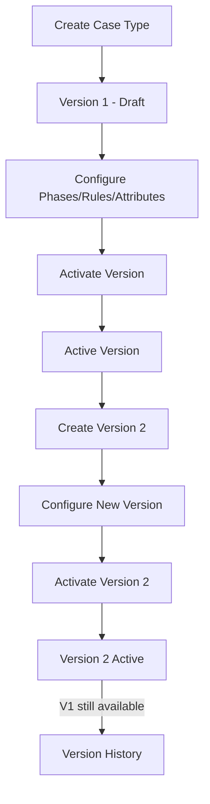

# Catalog & Administration -- xxllnc Zaken

## Purpose

Manages the configuration catalog of the zaaksysteem: case type definitions, versioning, attributes, document templates, email templates, folders, integrations, logging, and user management.

## Architecture Overview

- **HTTP Service:** `zsnl_admin_http` (path `/api/v2/admin/`)
- **Domain:** `zsnl_domains/admin/` (sub-domains: catalog, integrations, logging, users)
- **Frontend Module:** `caseTypeManagement`, `catalog`, `configuration`, `integrations`, `users`

## Data Model

### Case Type System

**CaseType** -- top-level case type definition:
- UUID, name, online status
- Organized in folder hierarchy
- Can be deleted (with cascading)

**CaseTypeVersion** -- versioned configuration:
- Each case type has multiple versions
- Only one version is "active" at a time
- Versions contain: phases, terms (lead time), rules, attributes, result types
- Version activation is explicit (admin action)

**VersionedCasetype** -- unified view combining type + version:
- Create, update, get operations
- Encapsulates the version-switching complexity

### Attributes

Configurable metadata fields for cases:
- Created, edited, deleted independently
- Searchable by name
- Referenced by case type versions
- "Magic string" support for template variables

### Templates

**Document Templates:**
- Template definitions for document generation
- Linked to case types
- Integration with external document systems (Xential, etc.)

**Email Templates:**
- Subject, body, sender fields
- Used for notifications (task assignment, case events)
- Template rendering with variable substitution

### Folder Structure

Hierarchical folder system for organizing catalog entries:
- Create, rename, delete folders
- Move entries between folders
- Get folder contents with entry details

### Integrations

**Types:**
- Appointment integrations (v1 and v2)
- Document integrations
- Email OAuth2 integrations (start/finish flow)

**Management:**
- Get active integrations by type
- Transaction tracking (list, detail, records)
- OAuth2 flow for email integration setup

### Logging

Event logs for audit trail:
- Query event logs with filtering
- All domain events logged by the logging consumer

### User Management

- Rename users
- User-level transaction history

## Business Logic

### Case Type Versioning

### API Endpoints (30 total)

**Catalog:**
- get_folder_contents, get_entry_detail, move_folder_entries
- change_case_type_online_status
- create/edit/delete_attribute, attribute_search, generate_magic_string
- create/edit/delete_email_template, get_email_template_detail
- create/edit/delete_document_template, get_document_template_detail
- get_case_type_history, activate_case_type_version
- delete_case_type, delete_folder, delete_object_type
- create/update/get_versioned_casetype
- create_folder, rename_folder, search_catalog

**Integrations:**
- get_integrations, get_active_appointment/document_integrations
- get_transaction/transactions/transaction_records/transaction_data
- start/finish_oauth2_flow

**Logging:** get_eventlogs
**Users:** rename_users

## Requirements (as observed)

1. Case types MUST be versioned; changes create new versions
2. Only one version can be active per case type
3. Case type definitions include phases, rules, terms, result types
4. Attributes are reusable across case types
5. Template-based document and email generation
6. Folder hierarchy for catalog organization
7. Integration management with transaction tracking
8. Complete audit logging via event consumers
9. OAuth2 flow support for email integration setup

## Comparison Notes

**vs Procest:**
- The case type versioning system is critical for production environments -- allows updating process definitions without affecting existing cases
- xxllnc's folder-based catalog organization provides a familiar admin UX
- Integration management with transaction tracking provides visibility into external system communication
- Procest's OpenRegister schemas serve a similar role but without explicit versioning
- The magic string / template variable system enables flexible document/email generation
