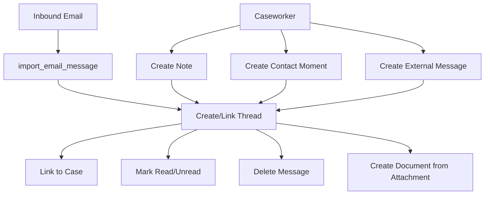

# Communication -- xxllnc Zaken

## Purpose

Manages all communication related to cases: email messages, internal notes, contact moments, and external messages. Provides threaded messaging linked to cases and contacts.

## Architecture Overview

- **HTTP Service:** `zsnl_communication_http` (path `/api/v2/communication/`)
- **Domain:** `zsnl_domains/communication/`
- **Consumer:** `zsnl_communication_consumer`
- **Frontend Package:** `communication-module` (reusable React component)

## Data Model

### Message Entity

Base message with polymorphic types:
- `uuid`, `thread_uuid`, `case_uuid`
- `message_slug`, `message_type` (external, note, contact_moment)
- `created_date`, `last_modified`, `message_date`
- `created_by` -- Contact reference
- `created_by_displayname`

Only `external` messages support read/unread marking.

### Thread Entity

Container for messages, linked to a case:
- Threads can be linked to cases (`link_thread_to_case`)
- Thread listing with filtering

### Contact Moment Entity

Record of citizen-government interaction:
- Linked to threads and cases
- Separate from email messages

### External Message Entity

Inbound/outbound external communication:
- Attachments support (upload, download, preview)

### Note Entity

Internal annotations by caseworkers.

### Attachments

File attachments on messages:
- Download and preview support
- Can be converted to case documents (`create_document_from_attachment`)

## Business Logic

### Communication Flow

### API Endpoints

| Endpoint | Method | Purpose |
|----------|--------|---------|
| get_thread_list | GET | List communication threads |
| get_message_list | GET | Messages in a thread |
| search_contact | GET | Search for contacts |
| search_case | GET | Search cases for linking |
| import_email_message | POST | Import external email |
| create_contact_moment | POST | Record contact moment |
| create_note | POST | Add internal note |
| create_external_message | POST | Send external message |
| get_case_list_for_contact | GET | Cases related to contact |
| download_attachment | GET | Download message attachment |
| preview_attachment | GET | Preview attachment |
| link_thread_to_case | POST | Link thread to case |
| delete_message | POST | Delete a message |
| mark_messages_read | POST | Mark as read |
| mark_messages_unread | POST | Mark as unread |
| get_contact_moment_list | GET | List contact moments |

## Requirements (as observed)

1. Messages belong to threads, which are linked to cases
2. Only `external` type messages can be marked read/unread
3. Email import creates messages from external email
4. Attachments can be promoted to case documents
5. Contact moments track citizen-government interactions
6. Notes provide internal-only communication within cases
7. Thread-case linking allows retroactive case association

## Comparison Notes

**vs Procest:**
- xxllnc has a full email-integrated communication system; Procest would use n8n for email integration
- The threaded messaging model with read/unread tracking is more sophisticated than basic case notes
- Contact moments as a separate entity align with Dutch government "contactmomenten" standards
- The reusable `communication-module` React package shows this is used across multiple apps (main + my-pip)
