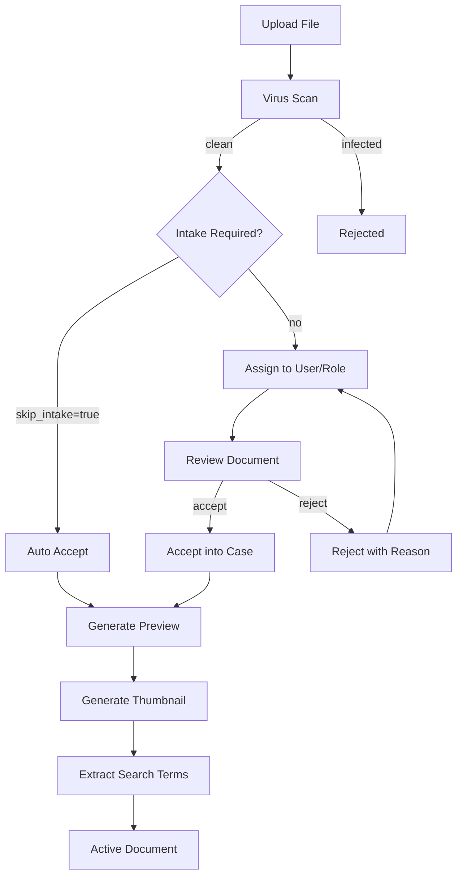

# Document Management -- xxllnc Zaken

## Purpose

Full document lifecycle management including upload, virus scanning, format conversion, preview generation, thumbnail creation, search indexing, intake workflow, archival classification, and WOPI-based online editing.

## Architecture Overview

- **HTTP Service:** `zsnl_document_http` (path `/api/v2/document/`)
- **Domain:** `zsnl_domains/document/`
- **Processing Consumer:** `zsnl_document_processing_consumer` (async preview/thumbnail/search)
- **Events Consumer:** `zsnl_documents_events_consumer`
- **File Storage:** Minio (S3-compatible)
- **Virus Scanning:** `http-virusscanner` service (ClamAV wrapper)
- **Format Conversion:** `http-documentconverter` service (PDF conversion)
- **Search:** Apache Tika for text extraction

## Data Model

### Document Entity

Core fields:
- `document_uuid`, `basename`, `extension`, `mimetype`, `size`
- `store_uuid`, `storage_location` -- S3 reference
- `directory_uuid`, `case_uuid` -- organizational links
- `md5` -- integrity hash
- `is_archivable` -- MIME type check against approved list
- `virus_scan_status` -- `pending`, `ok`, or failed
- `accepted` -- intake workflow flag
- `creator_uuid`, `creator_displayname`, `creator_type` (employee/citizen)

Preview/Thumbnail:
- `preview_uuid`, `preview_storage_location`, `preview_mimetype`
- `thumbnail_uuid`, `thumbnail_storage_location`, `thumbnail_mimetype`
- `has_search_index` -- full-text search enabled

Metadata:
- `origin` -- `Uitgaand`, `Intern`, `Inkomend` (outgoing/internal/incoming)
- `origin_date`
- `description`
- `confidentiality` -- 8 levels from `Openbaar` to `Zeer geheim`
- `document_category` -- 80+ Dutch government categories (Aanvraag, Beschikking, Vergunning, etc.)
- `document_source`, `document_number`, `current_version`
- `status` -- `Origineel`, `Kopie`, `Vervangen`, `Geconverteerd`
- `labels` -- list of DocumentLabel entities
- `publish` -- `{pip: bool, website: bool}` -- citizen portal / website visibility

Archival compliance:
- `pronom_format`, `appearance`, `structure`, `language`
- `integrity_check_successful`
- `destroy_reason`

Intake workflow:
- `intake_owner_uuid`, `intake_group_uuid`, `intake_role_uuid`
- `skip_intake`, `auto_accept`, `explicit_accept`
- `rejection_reason`, `rejected_by_display_name`

Locking:
- `lock` -- `{user_uuid, user_display_name, timestamp, shared}`
- WOPI lock support (acquire/extend/release)

### File Entity

Simpler standalone file without case association:
- `file_uuid`, `basename`, `extension`, `mimetype`, `size`
- `storage_location`, `md5`, `is_archivable`, `virus_scan_status`

### DocumentLabel

Labels for categorizing documents within cases.

## Business Logic

### Document Lifecycle

### Processing Pipeline

Documents go through async processing via AMQP consumers:
1. **Virus scan** -- ClamAV via `http-virusscanner`
2. **Preview generation** -- PDF conversion via `http-documentconverter` (size limit: 200MB)
3. **Thumbnail creation** -- from preview or direct (images)
4. **Search indexing** -- text extraction via Apache Tika

### Allowed MIME Types

Two tiers: standard and extended. Each MIME type is tagged with:
- `previewable` -- can generate PDF preview
- `thumbnailable` -- `direct` or `from_preview`
- `extract_search_terms` -- full-text indexable

### Document Locking (WOPI)

Two lock types:
1. **Standard lock** -- acquire/extend/release for general editing
2. **WOPI lock** -- for online collaborative editing (Xential, Microsoft Office)

### Intake Workflow

Documents can be:
1. Auto-accepted (skip intake entirely)
2. Assigned to a specific user for review
3. Assigned to a role/group for review
4. Rejected with reason (clears assignment, records rejection)

## Requirements (as observed)

1. All uploaded files MUST pass virus scanning before processing
2. 200MB size limit for preview and thumbnail generation
3. Filenames must not start with `.`
4. Documents linked to a case cannot be deleted (trash bin planned)
5. Intake rejection clears assignment and records reason
6. Already-accepted documents cannot be re-accepted
7. Documents must be in a case before acceptance
8. Document versioning via `as_version_of` UUID
9. 80+ Dutch government document categories supported
10. 8 confidentiality levels aligned with Dutch government standards
11. WOPI-based online editing with lock management
12. Document archiving with archive download requests
13. Label-based organization within cases
14. Directory/folder structure within cases

## Comparison Notes

**vs Procest/Docudesk:**
- xxllnc has a complete document processing pipeline (virus scan + conversion + preview + search) as separate microservices
- The intake workflow (assign-review-accept/reject) is more elaborate than Docudesk
- Dutch government document categories and confidentiality levels are deeply integrated
- WOPI locking for collaborative editing is built-in
- Docudesk handles file management but lacks the multi-stage intake workflow
- The archival compliance features (PRONOM, integrity checks, preservation) are significant
