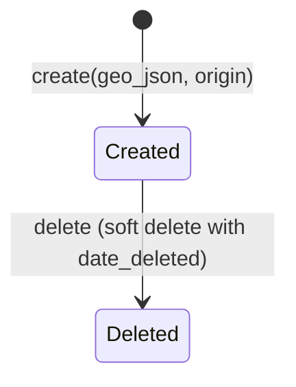

# Geo-Location -- xxllnc Zaken

## Purpose

Associates geographic features (GeoJSON) with cases and custom objects. Enables map-based case visualization and spatial queries.

## Architecture Overview

- **HTTP Service:** `zsnl_http_geo` (path `/api/v2/geo/`)
- **Domain:** `zsnl_domains/geo/`
- **Consumer:** `zsnl_consumer_geo` (async geo sync)
- **Entity version:** Uses Minty entity_v2 (Pydantic v2)

## Data Model

### GeoFeature Entity

```
GeoFeature:
  entity_type: "geo_feature"
  uuid: UUID
  geo_json: dict           # Full GeoJSON object
  origin: list[UUID]       # UUIDs explaining why this result was returned
  date_deleted: date       # Soft delete
  last_modified: datetime
```

### Supporting Entities

- **geo/entities/case.py** -- case geo data view
- **geo/entities/contact.py** -- contact location data
- **geo/entities/custom_object.py** -- object geo data
- **geo/entities/common.py** -- shared geo types

### Case Location

Cases have a `case_location` field and can have GeoFeature entities linked via the geo relationship system.

## Business Logic

### Geo Feature Lifecycle



### Origin Tracking

The `origin` field is a list of UUIDs indicating which entities caused this geo feature to appear in a query result. This supports:
- Direct geo features on a case
- Inherited geo features from related entities (contacts, custom objects)

### Geo Sync

The `zsnl_consumer_geo` consumer handles:
- Syncing geo values when cases or contacts change
- The `/api/v2/cm/sync_geo_values` endpoint triggers manual sync

### API Endpoints

| Endpoint | Method | Purpose |
|----------|--------|---------|
| /api/v2/geo/get_geo_features | GET | Get features for entity |
| /api/v2/geo/create_geo_feature | POST | Create new feature |

## Requirements (as observed)

1. GeoJSON-based feature storage
2. Origin tracking for relationship-based geo queries
3. Soft delete with date tracking
4. Async geo synchronization via AMQP consumer
5. Linked to cases, contacts, and custom objects

## Comparison Notes

**vs Procest:**
- xxllnc has built-in geo support; Procest has no current geo plans
- Useful for municipalities dealing with spatial cases (permits, public space, environment)
- The origin tracking system is sophisticated -- shows why a geo feature relates to a query
- Could be relevant for Procest if environmental/spatial case types are added
