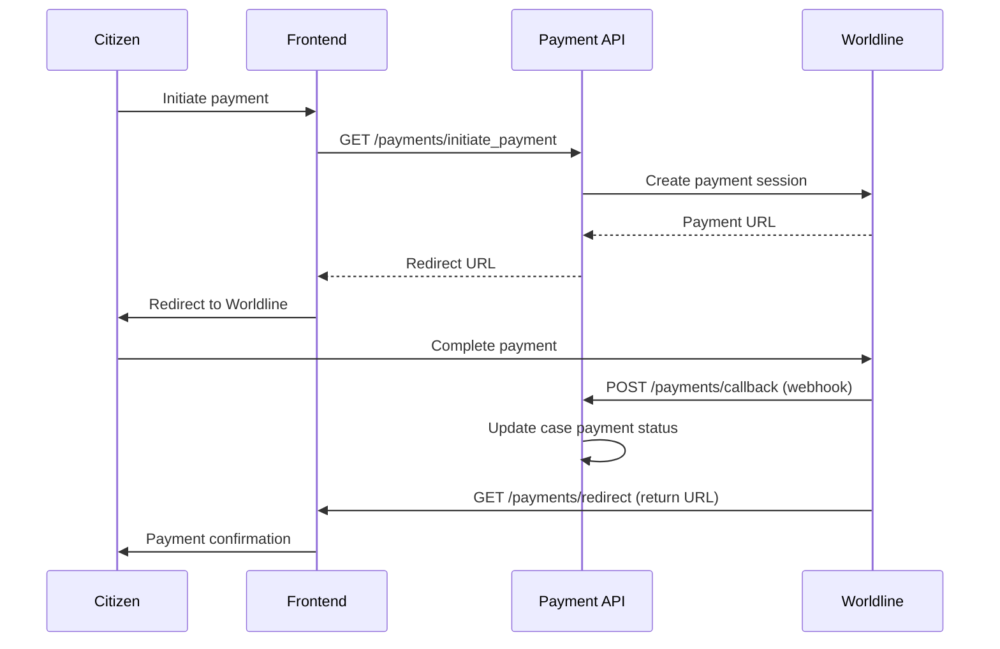

# Payments -- xxllnc Zaken

## Purpose

Online payment integration for cases that require fees (leges). Supports Worldline (formerly Ingenico/Ogone) payment gateway.

## Architecture Overview

- **API:** `/api/v2/cm/payments/` (part of case management HTTP)
- **Domain:** `zsnl_domains/payments/`
- **Integration:** Worldline payment gateway
- **Communication:** Perl API handles callback routing via internal key

## Data Model

### PaymentIntegration Entity

```
PaymentIntegration:
  entity_type: "worldline_payment_integration"
  interface_worldline_id: str
  interface_api_key_in_id: str
  interface_api_key_in: str
  interface_api_key_out_id: str
  interface_api_key_out: str
  interface_mode: str             # test/production
  interface_internal_key: str     # secret for Perl-Python communication
  last_successful_webhook_callback_test: str
```

### Case Payment Data

On the Case entity:
```
CasePayment:
  amount: float
  status: str
```

### Case Type Pricing

```
CaseTypePrice:
  web: str        # online channel price
  counter: str    # in-person price
  telephone: str  # phone channel price
  email: str      # email channel price
  employee: str   # internal price
  post: str       # postal channel price
```

## Business Logic

### Payment Flow



### API Endpoints

| Endpoint | Method | Purpose |
|----------|--------|---------|
| /api/v2/cm/payments/initiate_payment | GET | Start payment flow |
| /api/v2/cm/payments/redirect | GET | Return URL after payment |
| /api/v2/cm/payments/callback | POST | Worldline webhook callback |
| /api/v2/cm/payments/callback_test | GET | Test webhook connectivity |
| /api/v2/cm/payments/payment_test | GET | Test payment flow |
| /api/v2/cm/case/set_payment_status | POST | Manually set payment status |

### Channel-Based Pricing

Case types define different prices per contact channel (web, counter, telephone, email, employee, post). The applicable price depends on how the case was initiated.

## Requirements (as observed)

1. Worldline payment gateway integration
2. Dual API key system (inbound + outbound)
3. Test/production mode switching
4. Webhook callback verification and testing
5. Channel-based pricing per case type
6. Payment status tracking on cases
7. Internal key for secure Perl-Python communication
8. Redirect flow for citizen payment experience

## Comparison Notes

**vs Procest:**
- xxllnc has production-ready payment integration; Procest has no payment plans
- Channel-based pricing is a Dutch government requirement for many case types (leges)
- The Worldline integration is the dominant payment gateway for Dutch government
- If Procest targets municipal case management, payment integration will eventually be needed
