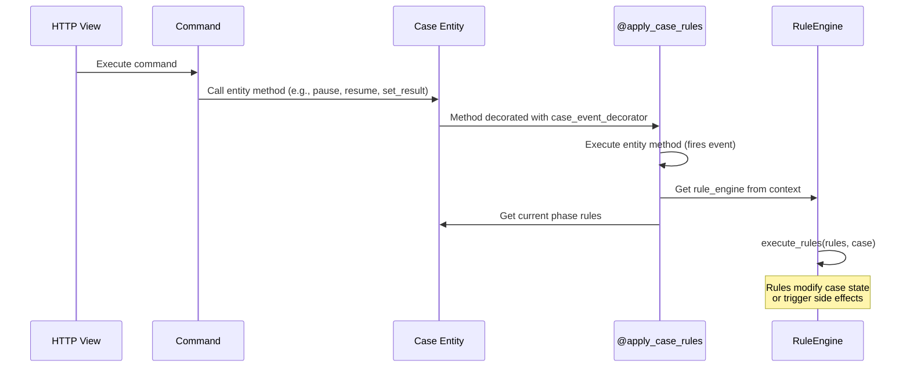

# Rule Engine -- xxllnc Zaken

## Purpose

Automatically executes business rules when case state changes occur. Rules are configured per phase in the case type version and fire after every case mutation.

## Architecture Overview

- **Location:** `zsnl_domains/case_management/services/` (RuleEngine class)
- **Integration:** Via `@apply_case_rules` decorator on Case entity methods
- **Trigger:** After every case entity event (via `case_event_decorator`)
- **Context:** Accessed via `zs_context_vars.rule_engine` context variable

## Business Logic

### Rule Execution Flow

### Integration Pattern

The `case_event_decorator` combines two behaviors:
1. `Entity.event()` -- fires a named event with `fire_always=True`
2. `apply_case_rules` -- executes phase rules after the event

This ensures that:
- Every case state change is recorded as an event
- Phase-specific rules are evaluated after every mutation
- Rules can further mutate the case (cascading changes)

### Rule Context

Rules have access to:
- The current `Case` entity with all its state
- The case type version's phase definitions
- The `RuleEngine` service from the command context

### Error Handling

If the `rule_engine` context variable is not set, a `CQRSException` is raised, indicating the command did not properly initialize as a subclass of `CaseCommandBase`.

## Requirements (as observed)

1. Rules are defined per phase in the case type version configuration
2. Rules execute automatically after every case entity event
3. Rules have access to the full case entity state
4. Commands MUST be subclasses of `CaseCommandBase` to provide the rule engine context
5. Rules can modify case state (cascading mutations)
6. Rules execute synchronously within the command transaction

## Comparison Notes

**vs Procest:**
- xxllnc embeds business rules directly in the case entity lifecycle
- Procest would use n8n workflows for similar automation
- The decorator-based approach means rules fire on EVERY case mutation -- no possibility of missing a trigger
- n8n provides more flexibility (external APIs, complex logic) but less transactional guarantees
- xxllnc rules are synchronous and transactional; n8n workflows are async
