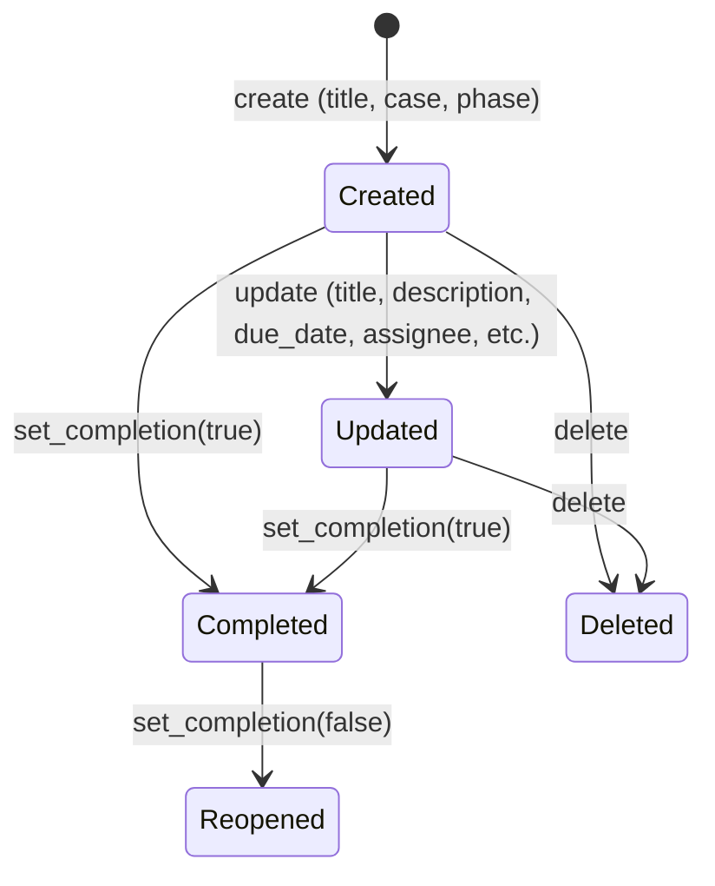

# Task Management -- xxllnc Zaken

## Purpose

Manages tasks within cases -- both system-generated tasks from case type phases and user-defined tasks created by caseworkers.

## Architecture Overview

- Part of the Case Management domain (`zsnl_domains/case_management/`)
- API at `/api/v2/cm/task/`
- Commands: `case_management/commands/task.py`
- Services: `case_management/services/task_template.py`

## Data Model

### Task Entity

```
Task:
  uuid: UUID
  title: str
  description: str
  due_date: date
  completed: bool
  user_defined: bool          # false = system-generated from case type
  phase: int                  # case milestone this task belongs to
  case: dict                  # {id, uuid, status, milestone}
  case_type: dict
  assignee: TaskAssigneeData  # {type: ContactType, id: UUID, display_name: str}
  department: dict
  product_code: str
  can_assign_externally: bool
  dso_action_request: bool    # DSO (Digitaal Stelsel Omgevingswet) flag
  notify_assignee: bool
  notification: TaskNotification  # email notification details
```

### TaskAssigneeData

```
TaskAssigneeData:
  type: ContactType  # person | organization | employee
  id: UUID
  display_name: str
```

### TaskNotification

```
TaskNotification:
  sender_name: str
  sender_address: str
  subject: str           # rendered from email template
  body: str              # rendered from email template
  recipient_address: str
  case_uuid: UUID
  case_id: int
  case_subject: str
  case_external_subject: str
```

## Business Logic

### Task Lifecycle



### Editability Rules

A task is editable when ALL of:
1. The case status is NOT `resolved`
2. The case's current milestone is NOT higher than the task's phase

This ensures tasks from past phases cannot be modified.

### Task Assignment & Notification

When a task is assigned:
1. Assignee data stored (type, id, display_name)
2. If `notify_assignee` is true, email notification prepared
3. Email rendered from email template using `TaskTemplateService`
4. Notification includes case context (subject, external subject, IDs)
5. Notification dispatched via event system

### Events Emitted

| Event | Trigger |
|-------|---------|
| TaskCreated | create() |
| TaskUpdated | update() |
| TaskDeleted | delete() |
| TaskCompletionSet | set_completion() |
| TaskAssigneeNotified | notify_task_assignee() |

### API Endpoints

| Endpoint | Method | Purpose |
|----------|--------|---------|
| /api/v2/cm/task/get_task_list | GET | List tasks for a case |
| /api/v2/cm/task/create | POST | Create user-defined task |
| /api/v2/cm/task/update | POST | Update task details |
| /api/v2/cm/task/delete | POST | Delete a task |
| /api/v2/cm/task/set_completion | POST | Toggle task completion |

## Requirements (as observed)

1. Tasks belong to a specific phase of a case
2. System-generated tasks (user_defined=false) come from case type definitions
3. Tasks are only editable when the case is in the relevant phase and not resolved
4. Task assignment triggers email notification via template rendering
5. DSO action request flag for Omgevingswet integration
6. Product codes for cost allocation
7. External assignment capability flag

## Comparison Notes

**vs Procest:**
- xxllnc tasks are phase-bound -- they become read-only when the case progresses past their phase
- System-generated tasks from case type definitions provide a checklist-like workflow
- Email notification on assignment is built-in with template rendering
- Procest tasks are independent; xxllnc tasks are tightly coupled to case lifecycle
- The DSO integration flag shows deep Dutch government domain knowledge
